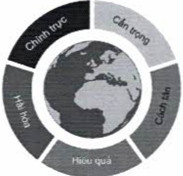

### 4.2. Xây dựng và duy trì văn hóa công ty lành mạnh

Văn hóa một công ty được thể hiện qua các giá trị theo đuổi, niềm tin về sự mệnh của công ty, và cách thức mà ban lãnh đạo và nhân viên của một công ty hành động, ứng xử với nhau và với các bên hữu quan, để đạt mục tiêu đã đề ra.

#### Giá trị cốt lỗi

Các giá trị cốt lỗi đóng vai trò là kim chỉ nam đối với mọi hành động của ban lãnh đạo và nhân viên của một doanh nghiệp. ACB theo đuổi năm giá trị cốt lỗi sau đây:

#### Quy tắc đạo đức nghề nghiệp

Quy định về Bộ quy tắc đạo đức nghề nghiệp áp dụng đối với nhân viên ACB được ban hành kèm theo Quyết định số 754/TCQĐ/-HĐQT.18 ngày 12 tháng 03 năm 2018.

- Quy định này đưa ra các quy tắc ứng xử mà ban lãnh đạo ACB nhận định là có tính chất chuẩn mực hoặc khuôn mẫu phù hợp với các giá trị cốt lỗi của ACB mà tất cả nhân viên cần thiết phải thực hiện theo để giữ gìn uy tín nghề nghiệp của mình và danh tiếng của ACB. Bộ quy tắc này là nội dung đào tạo bất bước cho toàn bộ nhân viên ACB hàng năm.

- Có bày quy tắc đạo đức nghệ nghiệp, được trình bày theo thứ tự từ lớn đến nhỏ về mặt nội dung, lần lượt là: tôn trọng quyền con người, tuân thủ pháp luật, bảo vệ tài sản doanh nghiệp, ứng xử với các đối tượng hữu quan chính (khách hàng, đồng nghiệp), ứng xử đối với hai vấn đề quan trọng trong tài chính ngân hàng (bảo mật thông tin và chống gian lận/tham những).