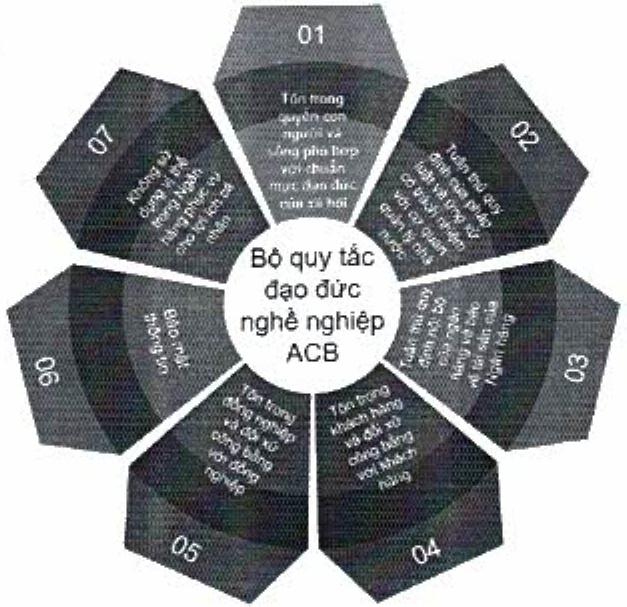
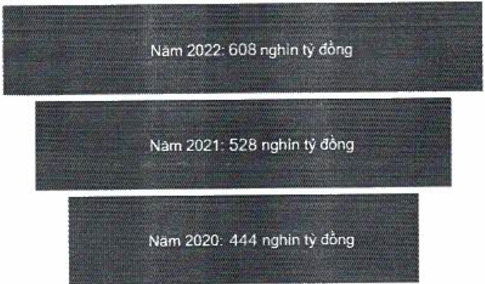

### 4.3. Phát triển an toàn, hiệu quả và cạnh tranh.

ACB đã chứng minh khả năng phát triển bền vững qua một số chỉ tiêu như sau:

Tổng tài sản tăng trưởng hàng năm

Tổng tài sản tại ACB liên tục tăng trong giai đoạn ba năm 2020 - 2022. Trong năm 2022, tổng tài sản tại ACB tăng 15%, từ 528 nghìn tỷ đồng trong năm 2021 lên 608 nghìn tỷ đồng.

##### ROE duy tri ở mức cao

Trong năm 2021, do ảnh hưởng bởi đại dịch Covid-19, ROE tại ACB có sự giảm nhẹ 0,40% so với năm 2020, đạt 23,90%. Tuy nhiên, bước sang năm 2022, ACB đã phục hồi mạnh mẽ sau đại dịch, với mức tăng 2,60% đạt 26,50%, mức cao nhất trong vòng ba năm qua. Tại ACB, một trong