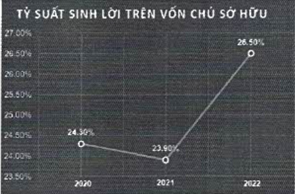
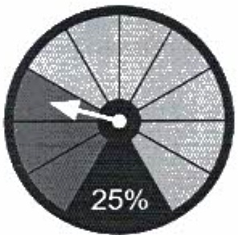

các mục tiêu chiến lược trong giai đoạn 2019 - 2024 là ROE đạt trên 20%. Tính đến thời điểm hiện tại, ACB đã và đang hoàn thành tốt mục tiêu này.

Tỷ lệ nợ xấu thấp, tỷ lệ bao phủ nợ xấu cao

Trong bày năm qua, ACB duy trì tỷ lệ nợ xấu dưới 1%, là tỷ lệ thấp nhất trong các ngân hàng thương mại cổ phần. Trong khi đó, tỷ lệ bao phú nợ xấu luôn giữ ở mức cao, cho phép ACB linh hoạt hơn trong việc giảm dự phòng và cải thiện lợi nhuận.

<table border=1 style='margin: auto; word-wrap: break-word;'><tr><td style='text-align: center; word-wrap: break-word;'></td><td style='text-align: center; word-wrap: break-word;'>2020</td><td style='text-align: center; word-wrap: break-word;'>2021</td><td style='text-align: center; word-wrap: break-word;'>2022</td></tr><tr><td style='text-align: center; word-wrap: break-word;'>NPL</td><td style='text-align: center; word-wrap: break-word;'>0.59%</td><td style='text-align: center; word-wrap: break-word;'>0.77%</td><td style='text-align: center; word-wrap: break-word;'>0.74%</td></tr><tr><td style='text-align: center; word-wrap: break-word;'>LLR</td><td style='text-align: center; word-wrap: break-word;'>160%</td><td style='text-align: center; word-wrap: break-word;'>209%</td><td style='text-align: center; word-wrap: break-word;'>159%</td></tr></table>

Tỷ lệ chia cổ tức giữ nguyên trong ba năm qua

Tỷ lệ chia cổ tức (dividend payout ratio) giữ vững ở mức 25% trong năm 2020 - 2021 và dự kiến tiếp tục giữ nguyên trong năm 2022.

