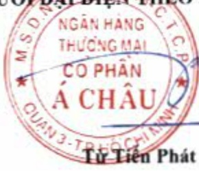

### IX. BÁO CÁO TÀI CHÍNH

### 9.1 Ý kiến kiểm toán

Xin xem Báo cáo kiểm toán độc lập của Công ty TNHH KPMG (Việt Nam) gửi cổ đồng Ngân hàng TMCP Á Châu trong Báo cáo tài chính hợp nhất năm 2022 ký ngày 28 tháng 02 năm 2023.

### 9.2 Báo cáo tài chính được kiểm toán

Xin xem Báo cáo tài chính định kèm.

luan

TP. Hồ Chí Minh, ngày 28 tháng 3 năm 2023

NGƯỜI DẠI DIỆN THEO PHÁP LUẬT

Từ Tiên Phát

Nơi nhận:

Ngân hàng Nhà nước CN TP. HCM,

Uy ban Chứng khoán Nhà nước,

Sở GDCK TP. Hồ Chí Minh.

##### Định kèm:

Báo cáo tài chính kiểm toán ACB năm 2022 (hợp nhất và riêng).