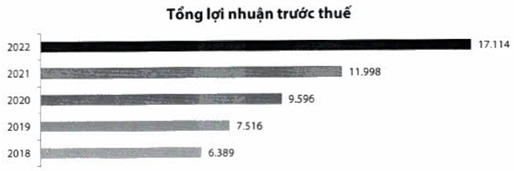

1.3.5. Tổng quan tính hình kinh doanh trong năm năm (2018 - 2022)

<table border=1 style='margin: auto; word-wrap: break-word;'><tr><td style='text-align: center; word-wrap: break-word;'>Quy mô (tỳ đồng)</td><td style='text-align: center; word-wrap: break-word;'>2018</td><td style='text-align: center; word-wrap: break-word;'>2019</td><td style='text-align: center; word-wrap: break-word;'>2020</td><td style='text-align: center; word-wrap: break-word;'>2021</td><td style='text-align: center; word-wrap: break-word;'>2022</td></tr><tr><td style='text-align: center; word-wrap: break-word;'>Tổng tài sản</td><td style='text-align: center; word-wrap: break-word;'>329.333</td><td style='text-align: center; word-wrap: break-word;'>383.514</td><td style='text-align: center; word-wrap: break-word;'>444.530</td><td style='text-align: center; word-wrap: break-word;'>527.770</td><td style='text-align: center; word-wrap: break-word;'>607.875</td></tr><tr><td style='text-align: center; word-wrap: break-word;'>Tiền, vàng gửi và cho các TCTD khác vay</td><td style='text-align: center; word-wrap: break-word;'>18.910</td><td style='text-align: center; word-wrap: break-word;'>30.442</td><td style='text-align: center; word-wrap: break-word;'>31.671</td><td style='text-align: center; word-wrap: break-word;'>49.819</td><td style='text-align: center; word-wrap: break-word;'>86.021</td></tr><tr><td style='text-align: center; word-wrap: break-word;'>Cho vay khách hàng</td><td style='text-align: center; word-wrap: break-word;'>230.527</td><td style='text-align: center; word-wrap: break-word;'>268.701</td><td style='text-align: center; word-wrap: break-word;'>311.479</td><td style='text-align: center; word-wrap: break-word;'>361.913</td><td style='text-align: center; word-wrap: break-word;'>413.706</td></tr><tr><td style='text-align: center; word-wrap: break-word;'>Đầu tư tài chính</td><td style='text-align: center; word-wrap: break-word;'>55.337</td><td style='text-align: center; word-wrap: break-word;'>59.672</td><td style='text-align: center; word-wrap: break-word;'>70.229</td><td style='text-align: center; word-wrap: break-word;'>71.107</td><td style='text-align: center; word-wrap: break-word;'>77.159</td></tr><tr><td style='text-align: center; word-wrap: break-word;'>Tiền gửi của khách hàng</td><td style='text-align: center; word-wrap: break-word;'>269.999</td><td style='text-align: center; word-wrap: break-word;'>308.129</td><td style='text-align: center; word-wrap: break-word;'>353.196</td><td style='text-align: center; word-wrap: break-word;'>379.921</td><td style='text-align: center; word-wrap: break-word;'>413.953</td></tr><tr><td style='text-align: center; word-wrap: break-word;'>Tiền gửi và vay TCTD khác</td><td style='text-align: center; word-wrap: break-word;'>20.718</td><td style='text-align: center; word-wrap: break-word;'>19.249</td><td style='text-align: center; word-wrap: break-word;'>23.875</td><td style='text-align: center; word-wrap: break-word;'>54.394</td><td style='text-align: center; word-wrap: break-word;'>67.841</td></tr><tr><td style='text-align: center; word-wrap: break-word;'>Vốn chủ sở hữu</td><td style='text-align: center; word-wrap: break-word;'>21.018</td><td style='text-align: center; word-wrap: break-word;'>27.765</td><td style='text-align: center; word-wrap: break-word;'>35.448</td><td style='text-align: center; word-wrap: break-word;'>44.901</td><td style='text-align: center; word-wrap: break-word;'>58.439</td></tr><tr><td style='text-align: center; word-wrap: break-word;'>Vốn điều lệ</td><td style='text-align: center; word-wrap: break-word;'>12.886</td><td style='text-align: center; word-wrap: break-word;'>16.627</td><td style='text-align: center; word-wrap: break-word;'>21.616</td><td style='text-align: center; word-wrap: break-word;'>27.019</td><td style='text-align: center; word-wrap: break-word;'>33.774</td></tr><tr><td style='text-align: center; word-wrap: break-word;'>Kết quả kinh doanh (tỳ đồng)</td><td style='text-align: center; word-wrap: break-word;'>2018</td><td style='text-align: center; word-wrap: break-word;'>2019</td><td style='text-align: center; word-wrap: break-word;'>2020</td><td style='text-align: center; word-wrap: break-word;'>2021</td><td style='text-align: center; word-wrap: break-word;'>2022</td></tr><tr><td style='text-align: center; word-wrap: break-word;'>Thu nhập lãi thuần</td><td style='text-align: center; word-wrap: break-word;'>10.363</td><td style='text-align: center; word-wrap: break-word;'>12.112</td><td style='text-align: center; word-wrap: break-word;'>14.582</td><td style='text-align: center; word-wrap: break-word;'>18.945</td><td style='text-align: center; word-wrap: break-word;'>23.534</td></tr><tr><td style='text-align: center; word-wrap: break-word;'>Thu nhập ngoài lãi</td><td style='text-align: center; word-wrap: break-word;'>3.670</td><td style='text-align: center; word-wrap: break-word;'>3.985</td><td style='text-align: center; word-wrap: break-word;'>3.579</td><td style='text-align: center; word-wrap: break-word;'>4.619</td><td style='text-align: center; word-wrap: break-word;'>5.257</td></tr><tr><td style='text-align: center; word-wrap: break-word;'>Chi phí hoạt động</td><td style='text-align: center; word-wrap: break-word;'>6.712</td><td style='text-align: center; word-wrap: break-word;'>8.308</td><td style='text-align: center; word-wrap: break-word;'>7.624</td><td style='text-align: center; word-wrap: break-word;'>8.230</td><td style='text-align: center; word-wrap: break-word;'>11.605</td></tr><tr><td style='text-align: center; word-wrap: break-word;'>Chi phí dự phòng</td><td style='text-align: center; word-wrap: break-word;'>932</td><td style='text-align: center; word-wrap: break-word;'>274</td><td style='text-align: center; word-wrap: break-word;'>941</td><td style='text-align: center; word-wrap: break-word;'>3.336</td><td style='text-align: center; word-wrap: break-word;'>71</td></tr><tr><td style='text-align: center; word-wrap: break-word;'>Lợi nhuận trước thuế</td><td style='text-align: center; word-wrap: break-word;'>6.389</td><td style='text-align: center; word-wrap: break-word;'>7.516</td><td style='text-align: center; word-wrap: break-word;'>9.596</td><td style='text-align: center; word-wrap: break-word;'>11.998</td><td style='text-align: center; word-wrap: break-word;'>17.114</td></tr><tr><td style='text-align: center; word-wrap: break-word;'>Lợi nhuận sau thuế</td><td style='text-align: center; word-wrap: break-word;'>5.137</td><td style='text-align: center; word-wrap: break-word;'>6.010</td><td style='text-align: center; word-wrap: break-word;'>7.683</td><td style='text-align: center; word-wrap: break-word;'>9.603</td><td style='text-align: center; word-wrap: break-word;'>13.688</td></tr><tr><td style='text-align: center; word-wrap: break-word;'>Hệ sở an toàn vốn (%)</td><td style='text-align: center; word-wrap: break-word;'>2018</td><td style='text-align: center; word-wrap: break-word;'>2019</td><td style='text-align: center; word-wrap: break-word;'>2020</td><td style='text-align: center; word-wrap: break-word;'>2021</td><td style='text-align: center; word-wrap: break-word;'>2022</td></tr><tr><td style='text-align: center; word-wrap: break-word;'>CAR</td><td style='text-align: center; word-wrap: break-word;'>10,05</td><td style='text-align: center; word-wrap: break-word;'>10,91</td><td style='text-align: center; word-wrap: break-word;'>11,06</td><td style='text-align: center; word-wrap: break-word;'>11,23</td><td style='text-align: center; word-wrap: break-word;'>12,80</td></tr><tr><td style='text-align: center; word-wrap: break-word;'>CAR cấp 1</td><td style='text-align: center; word-wrap: break-word;'>8,59</td><td style='text-align: center; word-wrap: break-word;'>9,66</td><td style='text-align: center; word-wrap: break-word;'>10,37</td><td style='text-align: center; word-wrap: break-word;'>11,26</td><td style='text-align: center; word-wrap: break-word;'>12,69</td></tr><tr><td style='text-align: center; word-wrap: break-word;'>Vốn chủ sở hữu/Tống tài sản</td><td style='text-align: center; word-wrap: break-word;'>6,38</td><td style='text-align: center; word-wrap: break-word;'>7,24</td><td style='text-align: center; word-wrap: break-word;'>7,97</td><td style='text-align: center; word-wrap: break-word;'>8,51</td><td style='text-align: center; word-wrap: break-word;'>9,61</td></tr><tr><td style='text-align: center; word-wrap: break-word;'>Vốn chủ sở hữu/Tống cho vay khách hàng</td><td style='text-align: center; word-wrap: break-word;'>9,12</td><td style='text-align: center; word-wrap: break-word;'>10,33</td><td style='text-align: center; word-wrap: break-word;'>11,38</td><td style='text-align: center; word-wrap: break-word;'>12,41</td><td style='text-align: center; word-wrap: break-word;'>14,13</td></tr><tr><td style='text-align: center; word-wrap: break-word;'>Khả năng thanh khoản (%)</td><td style='text-align: center; word-wrap: break-word;'>2018</td><td style='text-align: center; word-wrap: break-word;'>2019</td><td style='text-align: center; word-wrap: break-word;'>2020</td><td style='text-align: center; word-wrap: break-word;'>2021</td><td style='text-align: center; word-wrap: break-word;'>2022</td></tr><tr><td style='text-align: center; word-wrap: break-word;'>Dự nợ cho vay/Tống tài sản</td><td style='text-align: center; word-wrap: break-word;'>70,00</td><td style='text-align: center; word-wrap: break-word;'>70,10</td><td style='text-align: center; word-wrap: break-word;'>70,10</td><td style='text-align: center; word-wrap: break-word;'>68,60</td><td style='text-align: center; word-wrap: break-word;'>68,10</td></tr><tr><td style='text-align: center; word-wrap: break-word;'>Tổng dư nợ cho vay/Tống tiền gửi khách hàng theo NHNN</td><td style='text-align: center; word-wrap: break-word;'>77,50</td><td style='text-align: center; word-wrap: break-word;'>77,60</td><td style='text-align: center; word-wrap: break-word;'>79,30</td><td style='text-align: center; word-wrap: break-word;'>79,00</td><td style='text-align: center; word-wrap: break-word;'>78,40</td></tr><tr><td style='text-align: center; word-wrap: break-word;'>Chất lượng tài sản</td><td style='text-align: center; word-wrap: break-word;'>2018</td><td style='text-align: center; word-wrap: break-word;'>2019</td><td style='text-align: center; word-wrap: break-word;'>2020</td><td style='text-align: center; word-wrap: break-word;'>2021</td><td style='text-align: center; word-wrap: break-word;'>2022</td></tr><tr><td style='text-align: center; word-wrap: break-word;'>Nợ xấu (tỷ đồng)</td><td style='text-align: center; word-wrap: break-word;'>1.675</td><td style='text-align: center; word-wrap: break-word;'>1.449</td><td style='text-align: center; word-wrap: break-word;'>1.840</td><td style='text-align: center; word-wrap: break-word;'>2.799</td><td style='text-align: center; word-wrap: break-word;'>3.045</td></tr><tr><td style='text-align: center; word-wrap: break-word;'>Nợ quá hạn (tỷ đồng)</td><td style='text-align: center; word-wrap: break-word;'>2.058</td><td style='text-align: center; word-wrap: break-word;'>2.080</td><td style='text-align: center; word-wrap: break-word;'>2.416</td><td style='text-align: center; word-wrap: break-word;'>4.697</td><td style='text-align: center; word-wrap: break-word;'>5.388</td></tr><tr><td style='text-align: center; word-wrap: break-word;'>Tỷ lệ nợ xấu (%)</td><td style='text-align: center; word-wrap: break-word;'>0,70</td><td style='text-align: center; word-wrap: break-word;'>0,50</td><td style='text-align: center; word-wrap: break-word;'>0,60</td><td style='text-align: center; word-wrap: break-word;'>0,80</td><td style='text-align: center; word-wrap: break-word;'>0,70</td></tr><tr><td style='text-align: center; word-wrap: break-word;'>Nhóm 5/Tổng nợ xấu (%)</td><td style='text-align: center; word-wrap: break-word;'>69,50</td><td style='text-align: center; word-wrap: break-word;'>62,30</td><td style='text-align: center; word-wrap: break-word;'>66,10</td><td style='text-align: center; word-wrap: break-word;'>49,30</td><td style='text-align: center; word-wrap: break-word;'>71,10</td></tr><tr><td style='text-align: center; word-wrap: break-word;'>Tỷ lệ nợ quá hạn (%)</td><td style='text-align: center; word-wrap: break-word;'>0,90</td><td style='text-align: center; word-wrap: break-word;'>0,80</td><td style='text-align: center; word-wrap: break-word;'>0,80</td><td style='text-align: center; word-wrap: break-word;'>1,30</td><td style='text-align: center; word-wrap: break-word;'>1,30</td></tr><tr><td style='text-align: center; word-wrap: break-word;'>Quỹ dự phòng rủi ro/Tổng nợ xấu (%)</td><td style='text-align: center; word-wrap: break-word;'>151,90</td><td style='text-align: center; word-wrap: break-word;'>175,00</td><td style='text-align: center; word-wrap: break-word;'>160,30</td><td style='text-align: center; word-wrap: break-word;'>209,40</td><td style='text-align: center; word-wrap: break-word;'>159,30</td></tr><tr><td style='text-align: center; word-wrap: break-word;'>(Vốn chủ sở hữu + Dự phòng) Tổng nợ xấu (số lần)</td><td style='text-align: center; word-wrap: break-word;'>13</td><td style='text-align: center; word-wrap: break-word;'>19</td><td style='text-align: center; word-wrap: break-word;'>19</td><td style='text-align: center; word-wrap: break-word;'>18</td><td style='text-align: center; word-wrap: break-word;'>21</td></tr><tr><td style='text-align: center; word-wrap: break-word;'>CASA (%)</td><td style='text-align: center; word-wrap: break-word;'>17,50</td><td style='text-align: center; word-wrap: break-word;'>19,10</td><td style='text-align: center; word-wrap: break-word;'>21,60</td><td style='text-align: center; word-wrap: break-word;'>25,50</td><td style='text-align: center; word-wrap: break-word;'>22,30</td></tr><tr><td style='text-align: center; word-wrap: break-word;'>Khả năng sinh lời (%)</td><td style='text-align: center; word-wrap: break-word;'>2018</td><td style='text-align: center; word-wrap: break-word;'>2019</td><td style='text-align: center; word-wrap: break-word;'>2020</td><td style='text-align: center; word-wrap: break-word;'>2021</td><td style='text-align: center; word-wrap: break-word;'>2022</td></tr><tr><td style='text-align: center; word-wrap: break-word;'>ROE</td><td style='text-align: center; word-wrap: break-word;'>27,70</td><td style='text-align: center; word-wrap: break-word;'>24,60</td><td style='text-align: center; word-wrap: break-word;'>24,30</td><td style='text-align: center; word-wrap: break-word;'>23,90</td><td style='text-align: center; word-wrap: break-word;'>26,50</td></tr><tr><td style='text-align: center; word-wrap: break-word;'>ROA</td><td style='text-align: center; word-wrap: break-word;'>1,70</td><td style='text-align: center; word-wrap: break-word;'>1,70</td><td style='text-align: center; word-wrap: break-word;'>1,90</td><td style='text-align: center; word-wrap: break-word;'>2,00</td><td style='text-align: center; word-wrap: break-word;'>2,40</td></tr><tr><td style='text-align: center; word-wrap: break-word;'>NIM</td><td style='text-align: center; word-wrap: break-word;'>3,40</td><td style='text-align: center; word-wrap: break-word;'>3,40</td><td style='text-align: center; word-wrap: break-word;'>3,50</td><td style='text-align: center; word-wrap: break-word;'>3,90</td><td style='text-align: center; word-wrap: break-word;'>4,10</td></tr><tr><td style='text-align: center; word-wrap: break-word;'>Thu nhập ngoài lãi/Tổng thu nhập</td><td style='text-align: center; word-wrap: break-word;'>26,20</td><td style='text-align: center; word-wrap: break-word;'>24,80</td><td style='text-align: center; word-wrap: break-word;'>19,70</td><td style='text-align: center; word-wrap: break-word;'>19,60</td><td style='text-align: center; word-wrap: break-word;'>18,30</td></tr><tr><td style='text-align: center; word-wrap: break-word;'>Chi phí hoạt động/Tổng thu nhập</td><td style='text-align: center; word-wrap: break-word;'>47,80</td><td style='text-align: center; word-wrap: break-word;'>51,60</td><td style='text-align: center; word-wrap: break-word;'>42,00</td><td style='text-align: center; word-wrap: break-word;'>34,90</td><td style='text-align: center; word-wrap: break-word;'>40,30</td></tr><tr><td style='text-align: center; word-wrap: break-word;'>Chi phí dự phòng/Lợi nhuận trước dự phòng</td><td style='text-align: center; word-wrap: break-word;'>12,70</td><td style='text-align: center; word-wrap: break-word;'>3,50</td><td style='text-align: center; word-wrap: break-word;'>8,90</td><td style='text-align: center; word-wrap: break-word;'>21,80</td><td style='text-align: center; word-wrap: break-word;'>0,40</td></tr></table>