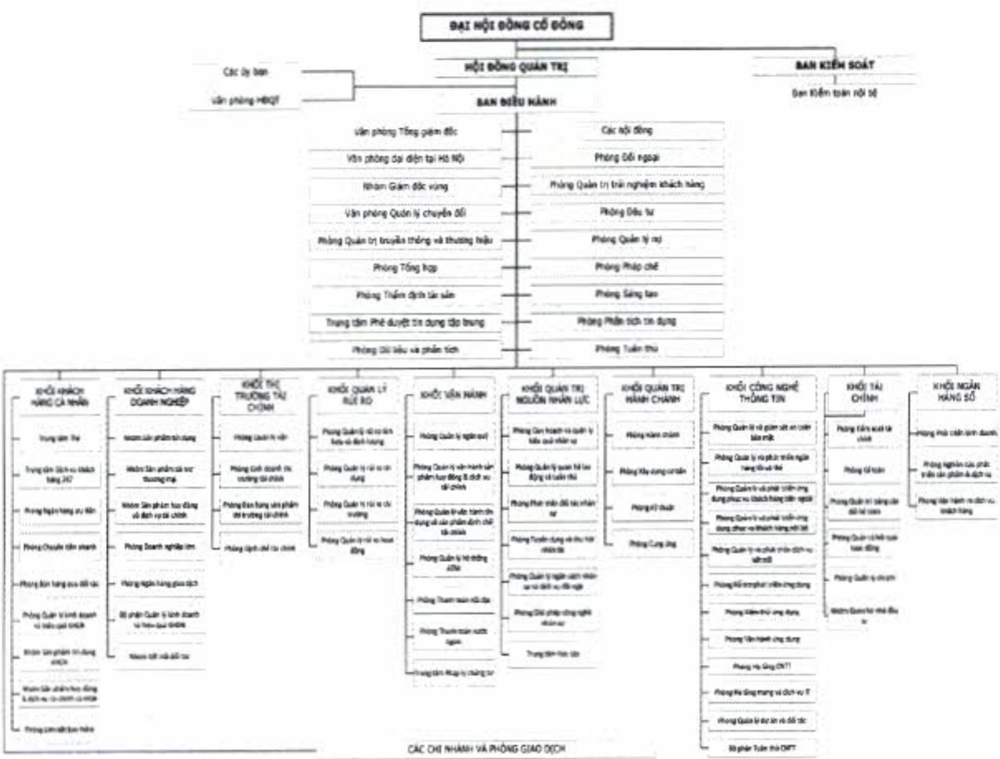

### 3.4. Các công ty con

(Xin xem mục 3.2. "Các công ty con" ở Chương II.)

4. Định hướng phát triển

4.1. Các mục tiêu chủ yếu về tài chính tín dụng năm 2023

Tổng tài sản tăng 10%, ước đạt 668.788 tỷ đồng;

Huy động khách hàng (gồm giấy tờ có giá ACB phát hành) tăng 8,01%, ước đạt 495.411 tỷ đồng;

- Dự nợ cho vay tăng 9,70% (*), ước đạt 453.836 tỷ đồng;

Lợi nhuận trước thuế Tập đoàn khoảng 20.058 tỷ đồng;

Tỷ lệ nợ xấu dưới 2%.

(*) Hạn mức tăng trưởng tín dụng năm 2023 được NHNN cấp theo CV số 1091/NHNN-CSTT ngày 24 tháng 02 năm 2023.

4.2. Chiến lược phát triển trung và dài hạn