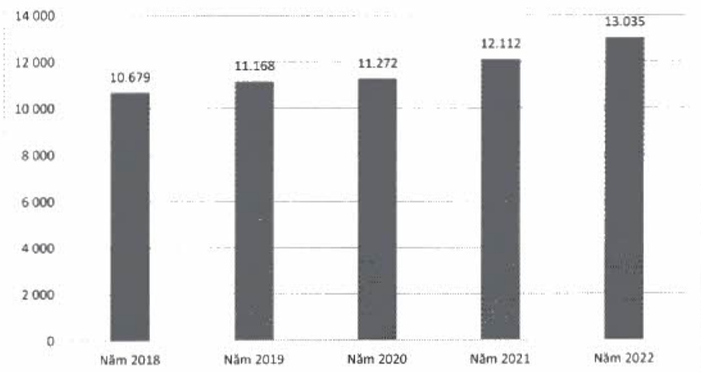
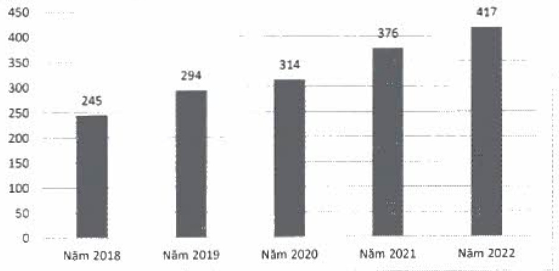

Ông Ngô Tấn Long được bỏ nhiệm Phó Tổng giám đốc ngày 12 tháng 01 năm 2023.

2.3. Số lượng cán bộ nhân viên, tóm tắt chính sách và thay đổi trong chính sách đối với người lao động

2.3.1. Số lượng cán bộ nhân viên 2018 - 2022 (theo BCTC hợp nhất)

Tính đến ngày 31 tháng 12 năm 2022, ACB có 13.035 nhân viên.

Số lượng nhân viên qua các năm

Mức thu nhập bình quân của người lao động (2018 - 2022)

Thu nhập bình quân của nhân viên trong năm 2022 là 417 triệu đồng.

Thu nhập bình quân của nhân viên qua các năm

