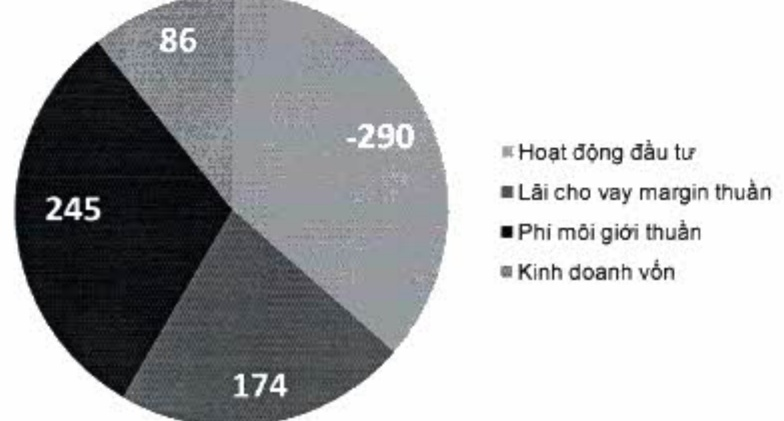

Kinh tế, chính trị thế giới năm 2022 trải qua nhiều khó khăn, bất ổn. Kinh tế Việt Nam cũng đối mặt nhiều thách thức, lãi suất gia tăng, lực cầu sụt giảm, doanh thu và lợi nhuận các doanh nghiệp suy yếu. Với tình hình nhiều biến động, thị trường chứng khoản đã không tránh khỏi các ảnh hưởng tiêu cực, dẫn tới việc hầu hết các công ty chứng khoản không thể hoàn thành kế hoạch kinh doanh năm 2022.

#### Kết quả hoạt động kinh doanh

Năm 2022, ACBS đạt lợi nhuận hoạt động là 214,8 tỷ đồng, trong đó lợi nhuận trước thuế là 97,8 tỷ đồng, tương ứng với 24% kế hoạch, chi tiết như sau:

ĐVT: Tỷ đồng

Lợi nhuận hoạt động ACBS năm 2022

Lợi nhuận từ cho vay ký quỹ (margin) đạt 174 tỷ đồng, tăng nhẹ 12% so với năm 2021 (155 tỷ đồng). Tuy thị trường bất lợi nhưng lãi cho vay ký quỹ thuần vẫn tăng nhẹ 12% so với năm 2021 và không phát sinh nợ xấu.

Lợi nhuận từ phí môi giới đạt 245 tỷ đồng, tăng nhẹ 11% so với năm 2021 (220 tỷ đồng), tuy thị trường chứng khoán Việt Nam giảm 32,80% và kết thúc năm với chỉ số VN-Index đạt 1.007,1 điểm. Thanh khoản trên thị trường chứng khoản cũng giảm mạnh từ mức bình quân 24.203,6 tỷ đồng/phiên trong quý 1/2022, thanh khoản giảm 57,20% và chỉ đạt bình quân 10.351,4 tỷ đồng/phiên trong quý 4/2022, nhưng phí môi giới thuần vẫn tăng.

Lợi nhuận từ hoạt động kinh doanh vốn đạt 86 tỷ đồng, tăng 41% so với cùng kỳ, trong khi năm 2021 đạt 61 tỷ đồng.

Hoạt động đầu tư lỗ 290 tỷ đồng, chủ yếu giảm về bán và đánh giá lại cổ phiếu giảm giá so với năm 2021.

##### Tình hình đấu tư

Năm 2022 nền kinh tế Việt Nam suy giảm kèm theo những sự kiện ảnh hưởng đến động vốn. Cũng chính vì xu thế đó mà quy mô đầu tư của ACBS đã phải liên tục thu hẹp để giảm thiếu