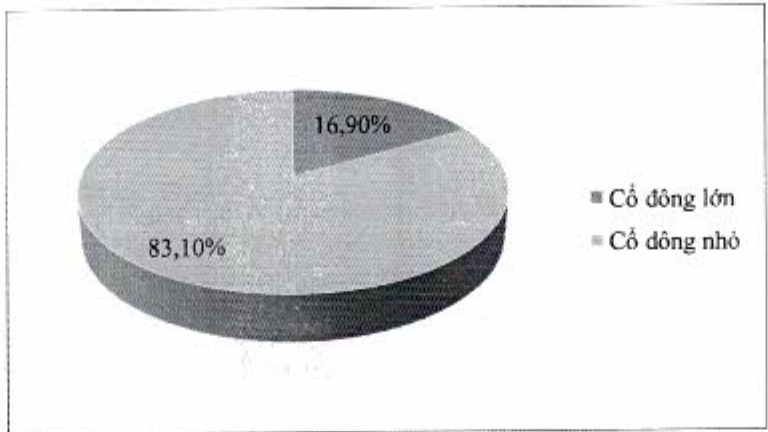

5. Cơ cấu cổ động, thay đổi vốn đầu tư của chủ sở hữu (Tính đến ngày 31 tháng 12 năm 2022.)

5.1. Cổ phần

Tổng số 3.377.435.094 cổ phần phổ thông ACB (tương ứng với vốn điều lệ là 33.774.350.940.000 đồng) bao gồm:

Số lượng cổ phần lưu hành: 3.377.435.094 cổ phần

Số lượng cổ phiếu quỹ: 0 cổ phiếu

Số lượng cổ phần tự do chuyển nhượng: 3.222.774.079 cổ phần

Số lượng cổ phần hạn chế chuyển nhượng: 154.661.015 cổ phần

5.2. Cơ cấu cổ động

#### 5.2.1. Theo tiêu chí tỷ lệ sở hữu (cổ động lớn [*], cổ động nhỏ)

<table border=1 style='margin: auto; word-wrap: break-word;'><tr><td style='text-align: center; word-wrap: break-word;'></td><td style='text-align: center; word-wrap: break-word;'>Số lượng cổ đông</td><td style='text-align: center; word-wrap: break-word;'>Số lượng cổ phần</td><td style='text-align: center; word-wrap: break-word;'>Tỷ lệ sở hữu cổ phần (%)</td></tr><tr><td style='text-align: center; word-wrap: break-word;'>Cổ đông lớn</td><td style='text-align: center; word-wrap: break-word;'>3</td><td style='text-align: center; word-wrap: break-word;'>570.926.138</td><td style='text-align: center; word-wrap: break-word;'>16,90</td></tr><tr><td style='text-align: center; word-wrap: break-word;'>Cổ đông nhỏ</td><td style='text-align: center; word-wrap: break-word;'>55.368</td><td style='text-align: center; word-wrap: break-word;'>2.806.508.956</td><td style='text-align: center; word-wrap: break-word;'>83,10</td></tr><tr><td style='text-align: center; word-wrap: break-word;'>Tổng cộng</td><td style='text-align: center; word-wrap: break-word;'>55.370</td><td style='text-align: center; word-wrap: break-word;'>3.377.435.094</td><td style='text-align: center; word-wrap: break-word;'>100</td></tr></table>

[*] Theo khoản 26 Điều 4 của Luật Các TCTD năm 2010 thì “cổ đông lớn của tổ chức tín dụng cổ phần là cổ đông sở hữu trực tiếp, gián tiếp từ 5% vốn cổ phần có quyền biểu quyết trở lên của tổ chức tín dụng cổ phần đó.”

#### 5.2.2. Theo tiêu chí cổ động tỗ chức và cổ động cá nhân