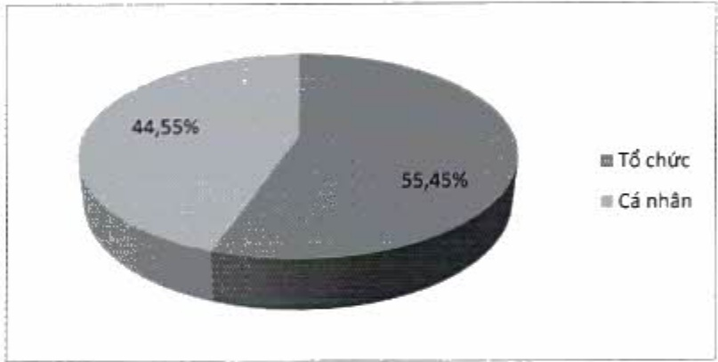
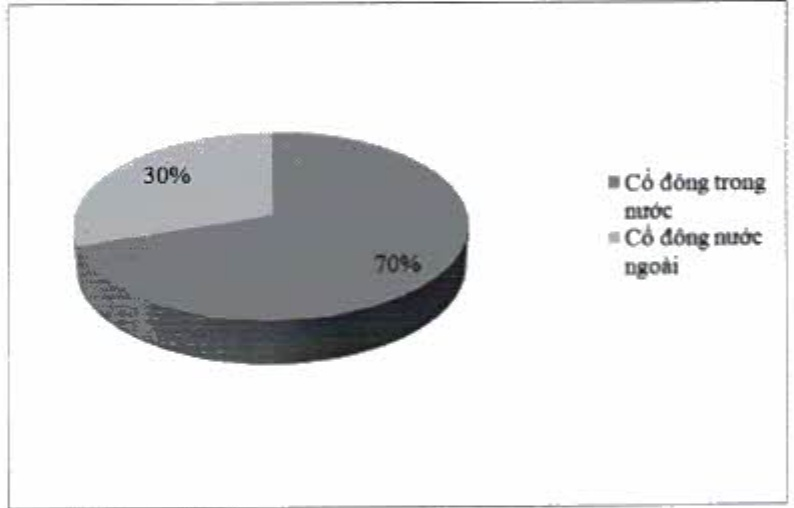

<table border=1 style='margin: auto; word-wrap: break-word;'><tr><td style='text-align: center; word-wrap: break-word;'></td><td style='text-align: center; word-wrap: break-word;'>Số lượng cổ đông</td><td style='text-align: center; word-wrap: break-word;'>Số lượng cổ phần</td><td style='text-align: center; word-wrap: break-word;'>Tỷ lệ sở hữu cổ phần (%)</td></tr><tr><td style='text-align: center; word-wrap: break-word;'>Tổ chức</td><td style='text-align: center; word-wrap: break-word;'>328</td><td style='text-align: center; word-wrap: break-word;'>1.872.728.696</td><td style='text-align: center; word-wrap: break-word;'>55,45</td></tr><tr><td style='text-align: center; word-wrap: break-word;'>Cả nhân</td><td style='text-align: center; word-wrap: break-word;'>55.042</td><td style='text-align: center; word-wrap: break-word;'>1.504.706.398</td><td style='text-align: center; word-wrap: break-word;'>44,55</td></tr><tr><td style='text-align: center; word-wrap: break-word;'>Tổng cộng</td><td style='text-align: center; word-wrap: break-word;'>55.370</td><td style='text-align: center; word-wrap: break-word;'>3.377.435.094</td><td style='text-align: center; word-wrap: break-word;'>100</td></tr></table>

5.2.3. Theo tiêu chí cổ động trong nước và cổ động nước ngoài

<table border=1 style='margin: auto; word-wrap: break-word;'><tr><td style='text-align: center; word-wrap: break-word;'></td><td style='text-align: center; word-wrap: break-word;'>Số lượng cổ đông</td><td style='text-align: center; word-wrap: break-word;'>Số lượng cổ phần</td><td style='text-align: center; word-wrap: break-word;'>Tỷ lệ sở hữu cổ phần (%)</td></tr><tr><td style='text-align: center; word-wrap: break-word;'>Cổ đông trong nước</td><td style='text-align: center; word-wrap: break-word;'>55.271</td><td style='text-align: center; word-wrap: break-word;'>2.364.204.566</td><td style='text-align: center; word-wrap: break-word;'>70</td></tr><tr><td style='text-align: center; word-wrap: break-word;'>Cổ đông nước ngoài</td><td style='text-align: center; word-wrap: break-word;'>99</td><td style='text-align: center; word-wrap: break-word;'>1.013.230.528</td><td style='text-align: center; word-wrap: break-word;'>30</td></tr><tr><td style='text-align: center; word-wrap: break-word;'>Tổng cộng</td><td style='text-align: center; word-wrap: break-word;'>55.370</td><td style='text-align: center; word-wrap: break-word;'>3.377.435.094</td><td style='text-align: center; word-wrap: break-word;'>100</td></tr></table>

