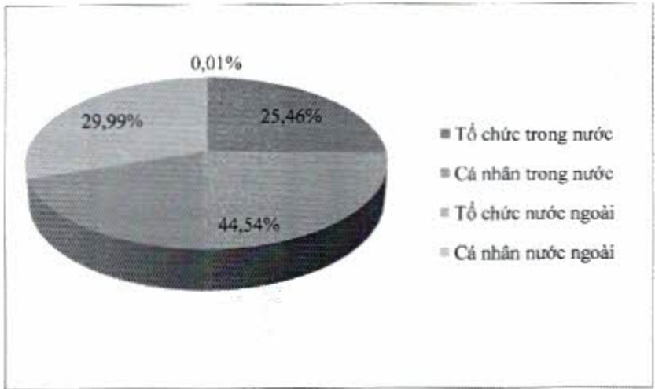

5.2.4. Theo tiêu chí cổ động trong nước và cổ động nước ngoài, cổ động tổ chức và cổ động cá nhân

<table border=1 style='margin: auto; word-wrap: break-word;'><tr><td style='text-align: center; word-wrap: break-word;'></td><td style='text-align: center; word-wrap: break-word;'>Số lượng cổ đông</td><td style='text-align: center; word-wrap: break-word;'>Số lượng cổ phần</td><td style='text-align: center; word-wrap: break-word;'>Tỷ lệ sở hữu cổ phần (%)</td></tr><tr><td style='text-align: center; word-wrap: break-word;'>Cổ đông trong nước (1)</td><td style='text-align: center; word-wrap: break-word;'>55.271</td><td style='text-align: center; word-wrap: break-word;'>2.364.204.566</td><td style='text-align: center; word-wrap: break-word;'>70</td></tr><tr><td style='text-align: center; word-wrap: break-word;'>- Tổ chức</td><td style='text-align: center; word-wrap: break-word;'>266</td><td style='text-align: center; word-wrap: break-word;'>859.753.250</td><td style='text-align: center; word-wrap: break-word;'>25,46</td></tr><tr><td style='text-align: center; word-wrap: break-word;'>- Cá nhân</td><td style='text-align: center; word-wrap: break-word;'>55.005</td><td style='text-align: center; word-wrap: break-word;'>1.504.451.316</td><td style='text-align: center; word-wrap: break-word;'>44,54</td></tr><tr><td style='text-align: center; word-wrap: break-word;'>Cổ đông nước ngoài (2)</td><td style='text-align: center; word-wrap: break-word;'>99</td><td style='text-align: center; word-wrap: break-word;'>1.013.230.528</td><td style='text-align: center; word-wrap: break-word;'>30</td></tr><tr><td style='text-align: center; word-wrap: break-word;'>- Tổ chức</td><td style='text-align: center; word-wrap: break-word;'>62</td><td style='text-align: center; word-wrap: break-word;'>1.012.975.446</td><td style='text-align: center; word-wrap: break-word;'>29,99</td></tr><tr><td style='text-align: center; word-wrap: break-word;'>- Cá nhân</td><td style='text-align: center; word-wrap: break-word;'>37</td><td style='text-align: center; word-wrap: break-word;'>255.082</td><td style='text-align: center; word-wrap: break-word;'>0,01</td></tr><tr><td style='text-align: center; word-wrap: break-word;'>Cộng (1) &amp; (2)</td><td style='text-align: center; word-wrap: break-word;'>55.370</td><td style='text-align: center; word-wrap: break-word;'>3.377.435.094</td><td style='text-align: center; word-wrap: break-word;'>100</td></tr></table>

#### 5.2.5. Cổ đông lớn nước ngoài

Tỷ lệ sở hữu nước ngoài tối đa tại ACB là 30%.

Cổ đông lớn nước ngoài sở hữu trực tiếp hoặc gián tiếp từ 5% vốn cổ phần có quyền biểu quyết trở lên, gồm có: