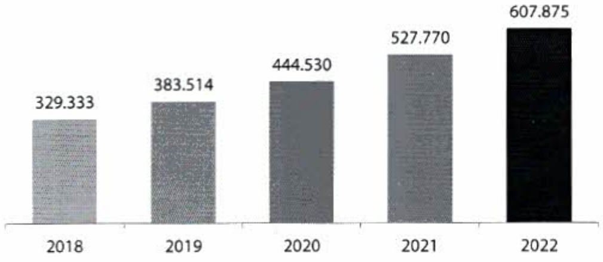

Xếp hàng của Fitch Ratings ngày 22 tháng 11 năm 2022:

<table border=1 style='margin: auto; word-wrap: break-word;'><tr><td style='text-align: center; word-wrap: break-word;'>Hạng mục</td><td style='text-align: center; word-wrap: break-word;'>Xếp hàng</td></tr><tr><td style='text-align: center; word-wrap: break-word;'>Xếp hạng phát hành nọ dài hạn</td><td style='text-align: center; word-wrap: break-word;'>BB-</td></tr><tr><td style='text-align: center; word-wrap: break-word;'>Xếp hạng phát hành nọ ngắn hạn</td><td style='text-align: center; word-wrap: break-word;'>B</td></tr><tr><td style='text-align: center; word-wrap: break-word;'>Xếp hạng sức mạnh độc lập</td><td style='text-align: center; word-wrap: break-word;'>bb-</td></tr><tr><td style='text-align: center; word-wrap: break-word;'>Xếp hạng hỗ trợ của Chính phủ</td><td style='text-align: center; word-wrap: break-word;'>b+</td></tr><tr><td style='text-align: center; word-wrap: break-word;'>Triển vọng tiền gửi ngoại tệ dài hạn</td><td style='text-align: center; word-wrap: break-word;'>Ôn định</td></tr></table>

Các mức xếp hàng tin nhiệm nói trên của ACB là thứ hàng cao trong các ngân hàng được xếp hàng tại Việt Nam.

## 2. Tình hình tài chính

#### Phân tích bảng cân đối kế toán

#### 2.1.1. Tổng tài sản

Tổng tài sản hợp nhất tăng trưởng đều đặn trong năm năm liên tiếp từ 2018 - 2022, với tổc độ tăng trưởng bình quân là 17%. Cụ thể, tổng tài sản đạt 608 nghìn tỷ đồng, tăng hơn 15% so với cuối năm 2021, và vượt 3% kế hoạch đã đề ra.

Tổng tài sản

