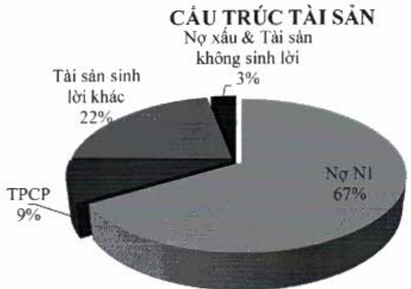

- Cơ cấu tài sản tiếp tục duy trì cấu trúc theo hướng gia tăng tỷ trọng tài sản sinh lời, đạt đến 97% tổng tài sản, riêng nợ nhóm 1 chiếm đến khoảng 67%, đảm bảo tối đa hóa hiệu quả sử dụng vốn.

#### 2.1.2. Vốn

Đến hết năm 2022, tỷ lệ an toàn vốn hợp nhất đạt ở mức 12,80%, cao hơn nhiều mức 8% theo quy định. Tổng vốn tự có đạt hơn 58 nghìn tỷ đồng, tăng 32% so với năm 2021.

<table border=1 style='margin: auto; word-wrap: break-word;'><tr><td style='text-align: center; word-wrap: break-word;'>Chi tiêu</td><td style='text-align: center; word-wrap: break-word;'>2018</td><td style='text-align: center; word-wrap: break-word;'>2019</td><td style='text-align: center; word-wrap: break-word;'>2020</td><td style='text-align: center; word-wrap: break-word;'>2021</td><td style='text-align: center; word-wrap: break-word;'>2022</td></tr><tr><td style='text-align: center; word-wrap: break-word;'>An toàn vốn (%)</td><td style='text-align: center; word-wrap: break-word;'>10,05</td><td style='text-align: center; word-wrap: break-word;'>10,91</td><td style='text-align: center; word-wrap: break-word;'>11,06</td><td style='text-align: center; word-wrap: break-word;'>11,23</td><td style='text-align: center; word-wrap: break-word;'>12,80</td></tr><tr><td style='text-align: center; word-wrap: break-word;'>An toàn vốn cấp 1 (%)</td><td style='text-align: center; word-wrap: break-word;'>8,59</td><td style='text-align: center; word-wrap: break-word;'>9,66</td><td style='text-align: center; word-wrap: break-word;'>10,37</td><td style='text-align: center; word-wrap: break-word;'>11,26</td><td style='text-align: center; word-wrap: break-word;'>12,69</td></tr><tr><td style='text-align: center; word-wrap: break-word;'>Tổng tài sản có rủi ro (tỷ đồng)</td><td style='text-align: center; word-wrap: break-word;'>240.968</td><td style='text-align: center; word-wrap: break-word;'>283.931</td><td style='text-align: center; word-wrap: break-word;'>338.337</td><td style='text-align: center; word-wrap: break-word;'>395.018</td><td style='text-align: center; word-wrap: break-word;'>457.049</td></tr><tr><td style='text-align: center; word-wrap: break-word;'>Vốn tự có (tỷ đồng)</td><td style='text-align: center; word-wrap: break-word;'>24.226</td><td style='text-align: center; word-wrap: break-word;'>30.977</td><td style='text-align: center; word-wrap: break-word;'>37.414</td><td style='text-align: center; word-wrap: break-word;'>44.374</td><td style='text-align: center; word-wrap: break-word;'>58.519</td></tr></table>

- ACB là một trong những ngân hàng hoàn thành sớm ba trụ cột của Basel II theo Thông tư số 41/2016/TT-NHNN, và Thông tư số 13/2018/TT-NHNN để nâng cao năng lực quản trị rủi ro. ACB đã áp dụng ICAAP, trụ cột thứ hai của Basel III, thông qua việc thiết lập các chi tiêu đánh giá kết quả hoạt động gắn liền với rủi ro, định hướng danh mục kinh doanh.

Cuối năm 2022, ACB đã chính thức hoàn thành triển khai các nội dung trọng yếu ILAAP và chuẩn mực Basel III, một trong những chuẩn mực yêu cầu cao về vốn và quản lý rủi ro thanh khoản.

#### 2.1.3. Khả năng chi trả

- ACB luôn đảm bảo khả năng chi trả cao và linh hoạt trong chính sách điều hành hoạt động kinh doanh. Tỷ lệ dự trữ thanh khoản luôn vượt xa so với quy định tối thiểu (10%), ở mức