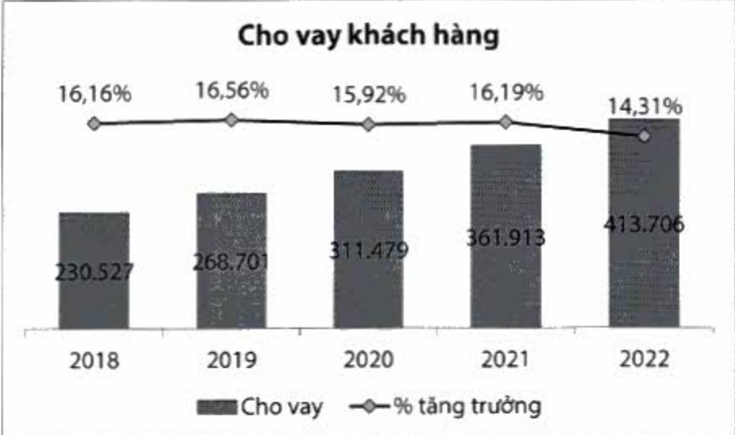

16,14% vào cuối năm 2022. Tỷ lệ của nguồn vốn ngắn hạn được sử dụng để cho vay trung hạn và dài hạn thì thấp hơn nhiều so với mức quy định tối đa (34%), đạt 19,63%. Về khả năng chỉ trả trong 30 ngày, đối với VND tỷ lệ này ở mức 71,89%, cao hơn nhiều quy định tối thiểu 50%; tỷ lệ này đối với các ngoại tệ khác luôn ở mức cao.

<table border=1 style='margin: auto; word-wrap: break-word;'><tr><td style='text-align: center; word-wrap: break-word;'>Chi tiêu (%)</td><td style='text-align: center; word-wrap: break-word;'>2022</td><td style='text-align: center; word-wrap: break-word;'>2021</td><td style='text-align: center; word-wrap: break-word;'>Quy định</td></tr><tr><td style='text-align: center; word-wrap: break-word;'>Tỷ lệ dự trữ thanh khoản</td><td style='text-align: center; word-wrap: break-word;'>16,14</td><td style='text-align: center; word-wrap: break-word;'>22,45</td><td style='text-align: center; word-wrap: break-word;'>≥ 10</td></tr><tr><td style='text-align: center; word-wrap: break-word;'>Khả năng chi trả trong 30 ngày</td><td style='text-align: center; word-wrap: break-word;'></td><td style='text-align: center; word-wrap: break-word;'></td><td style='text-align: center; word-wrap: break-word;'></td></tr><tr><td style='text-align: center; word-wrap: break-word;'>VND</td><td style='text-align: center; word-wrap: break-word;'>71,89</td><td style='text-align: center; word-wrap: break-word;'>73,91</td><td style='text-align: center; word-wrap: break-word;'>≥ 50</td></tr><tr><td style='text-align: center; word-wrap: break-word;'>Ngoại tệ khác</td><td style='text-align: center; word-wrap: break-word;'>156,90</td><td style='text-align: center; word-wrap: break-word;'>283,81</td><td style='text-align: center; word-wrap: break-word;'>≥ 10</td></tr><tr><td style='text-align: center; word-wrap: break-word;'>Tỷ lệ của nguồn vốn ngắn hạn được sử dụng cho vay trung hạn và dài hạn</td><td style='text-align: center; word-wrap: break-word;'>19,63</td><td style='text-align: center; word-wrap: break-word;'>22,69</td><td style='text-align: center; word-wrap: break-word;'>≤ 34</td></tr><tr><td style='text-align: center; word-wrap: break-word;'>Tổng dư nợ cho vay/Tổng tiền gửi</td><td style='text-align: center; word-wrap: break-word;'>78,38</td><td style='text-align: center; word-wrap: break-word;'>78,99</td><td style='text-align: center; word-wrap: break-word;'>≤ 85</td></tr></table>

#### 2.1.4. Hoạt động tín dụng

- Dự nợ cho vay đến cuối năm đạt 414 nghìn tỷ đồng, tăng 14,30% so với năm 2021. Cho vay vẫn duy trì theo hướng cho vay có tài sản thế chấp phù hợp với khâu vị rủi ro hiện hành, với 98% khoản vay có tài sản đảm bảo và tỷ lệ LTV của danh mục chi khoảng 54%.

Tin dụng khách hàng cá nhân vẫn là động lực tăng trưởng tín dụng toàn hàng, với quy mô 272 nghìn tỷ đồng, tăng 18% so với năm 2021. Tổng danh mục cho vay của nhóm khách hàng mảng bán lẻ chiếm đến 94% trên tổng số dư nợ cho vay.

