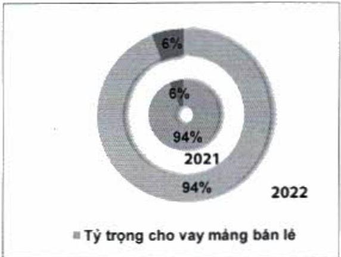
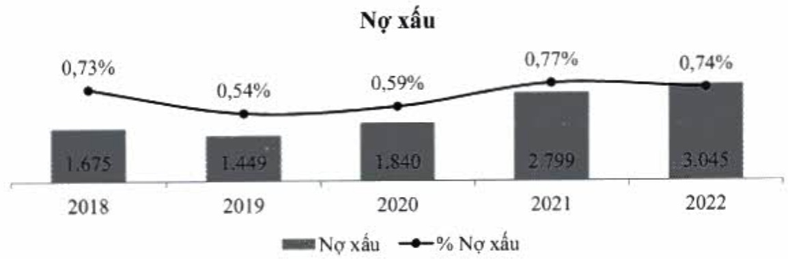

#### 2.1.5. Chất lượng tín dụng

Nợ xấu của ACB được kiểm soát chặt chẽ, chỉ chiếm 0,74% tổng dư nợ cho vay, mức tỷ lệ thấp hàng đầu thị trường. Tỷ lệ dự phòng/tổng nợ xấu được duy trì ở mức cao trong toàn ngành với mức 159%.

<table border=1 style='margin: auto; word-wrap: break-word;'><tr><td style='text-align: center; word-wrap: break-word;'>Chi tiêu</td><td style='text-align: center; word-wrap: break-word;'>2018</td><td style='text-align: center; word-wrap: break-word;'>2019</td><td style='text-align: center; word-wrap: break-word;'>2020</td><td style='text-align: center; word-wrap: break-word;'>2021</td><td style='text-align: center; word-wrap: break-word;'>2022</td></tr><tr><td style='text-align: center; word-wrap: break-word;'>Nợ nhóm 3-5 (tỷ đồng)</td><td style='text-align: center; word-wrap: break-word;'>1.675</td><td style='text-align: center; word-wrap: break-word;'>1.449</td><td style='text-align: center; word-wrap: break-word;'>1.840</td><td style='text-align: center; word-wrap: break-word;'>2.799</td><td style='text-align: center; word-wrap: break-word;'>3.045</td></tr><tr><td style='text-align: center; word-wrap: break-word;'>Tỷ lệ nợ nhóm 3-5/Tổng dư nợ cho vay (%)</td><td style='text-align: center; word-wrap: break-word;'>0,73</td><td style='text-align: center; word-wrap: break-word;'>0,54</td><td style='text-align: center; word-wrap: break-word;'>0,59</td><td style='text-align: center; word-wrap: break-word;'>0,77</td><td style='text-align: center; word-wrap: break-word;'>0,74</td></tr><tr><td style='text-align: center; word-wrap: break-word;'>Dự phòng/Tổng nợ xấu (%)</td><td style='text-align: center; word-wrap: break-word;'>152</td><td style='text-align: center; word-wrap: break-word;'>175</td><td style='text-align: center; word-wrap: break-word;'>160</td><td style='text-align: center; word-wrap: break-word;'>209</td><td style='text-align: center; word-wrap: break-word;'>159</td></tr></table>

#### 2.1.6. Hoạt động huy động vốn

- Trong năm vừa qua, huy động tiền gửi khách hàng trở thành màng cạnh tranh khóc liệt giữa các ngân hàng. Trong bối cảnh đó, ACB vẫn đạt mức tăng trưởng cao 9%, cao hơn so với năm 2021.