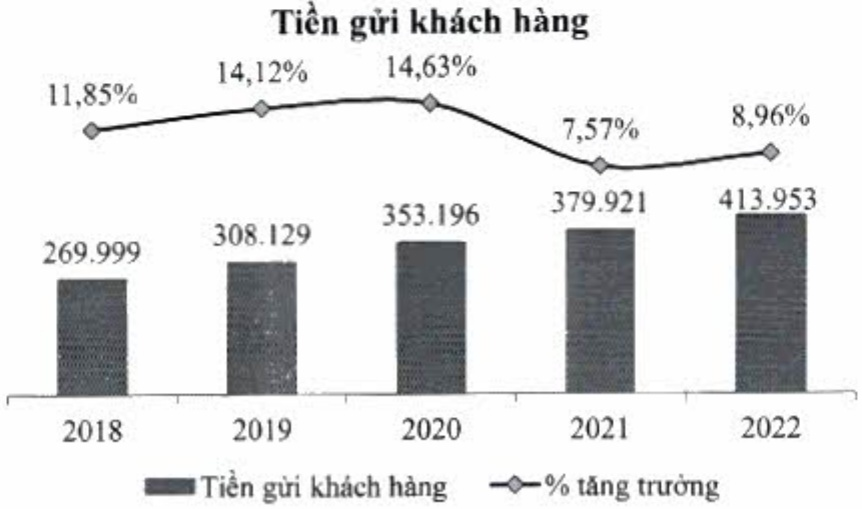
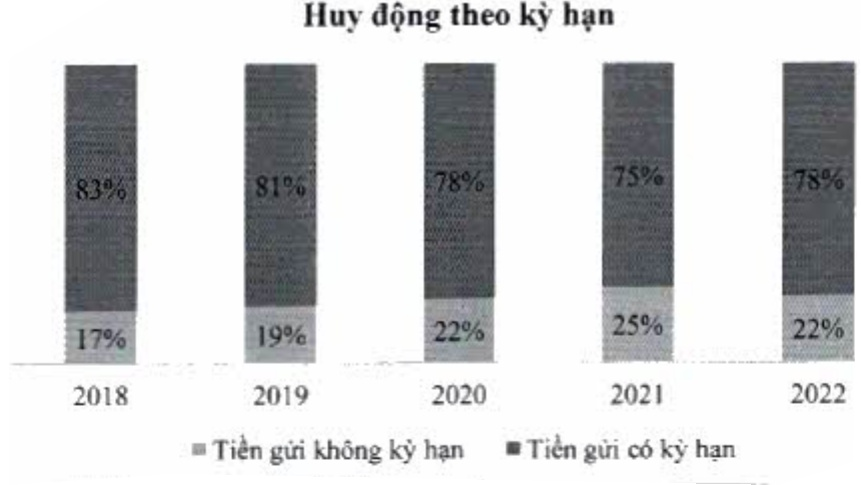

- ACB có tỷ trọng tiền gửi từ khách hàng cá nhân lên đến 80% tổng tiền gửi. Trong năm 2022, lãi suất tiền gửi tăng cao, tiền gửi có xu hướng chuyển dịch qua có kỳ hạn. Tiền gửi có kỳ hạn của ACB, đặc biệt là quý IV, tăng trưởng tốt với quy mô 322 nghìn tỷ đồng, tăng 14% so với năm 2021 (mức tăng trưởng cao nhất trong năm năm gần đây). Trong khi đó, tỷ trọng tiền gửi không kỳ hạn giảm từ 25% xuống 22% trên tổng tiền gửi, tuy nhiên vẫn duy trì vị trí tốp 4 trên thị trường.

Huy động theo kỳ hạn

#### 2.1.7. Vốn chủ sở hữu

Vốn chủ sở hữu tăng 30% so với năm 2021 và đạt 58 nghìn tỷ đồng, trong đó vốn điều lệ tăng 25% từ việc chi trả cổ tức bằng cổ phiếu với tỷ lệ 25%. Lợi nhuận chưa phân phối hơn 15 nghìn tỷ đồng.