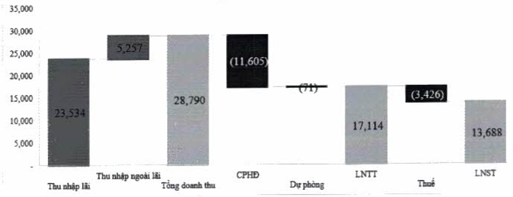

<table border=1 style='margin: auto; word-wrap: break-word;'><tr><td style='text-align: center; word-wrap: break-word;'>Chi tiêu</td><td style='text-align: center; word-wrap: break-word;'>2022</td><td style='text-align: center; word-wrap: break-word;'>2021</td><td style='text-align: center; word-wrap: break-word;'>% tăng giảm</td></tr><tr><td style='text-align: center; word-wrap: break-word;'>Vốn điều lệ</td><td style='text-align: center; word-wrap: break-word;'>33.774</td><td style='text-align: center; word-wrap: break-word;'>27.019</td><td style='text-align: center; word-wrap: break-word;'>25</td></tr><tr><td style='text-align: center; word-wrap: break-word;'>Thắng dư vốn cổ phần</td><td style='text-align: center; word-wrap: break-word;'>272</td><td style='text-align: center; word-wrap: break-word;'>272</td><td style='text-align: center; word-wrap: break-word;'>0</td></tr><tr><td style='text-align: center; word-wrap: break-word;'>Cổ phiếu quỹ</td><td style='text-align: center; word-wrap: break-word;'>-</td><td style='text-align: center; word-wrap: break-word;'>-</td><td style='text-align: center; word-wrap: break-word;'>0</td></tr><tr><td style='text-align: center; word-wrap: break-word;'>Quỹ của TCTD</td><td style='text-align: center; word-wrap: break-word;'>9.220</td><td style='text-align: center; word-wrap: break-word;'>7.164</td><td style='text-align: center; word-wrap: break-word;'>29</td></tr><tr><td style='text-align: center; word-wrap: break-word;'>Chênh lệch tỷ giá</td><td style='text-align: center; word-wrap: break-word;'>-</td><td style='text-align: center; word-wrap: break-word;'>-</td><td style='text-align: center; word-wrap: break-word;'>0</td></tr><tr><td style='text-align: center; word-wrap: break-word;'>Lợi nhuận chưa phân phối</td><td style='text-align: center; word-wrap: break-word;'>15.172</td><td style='text-align: center; word-wrap: break-word;'>10.445</td><td style='text-align: center; word-wrap: break-word;'>45</td></tr><tr><td style='text-align: center; word-wrap: break-word;'>Tổng vốn chủ sở hữu</td><td style='text-align: center; word-wrap: break-word;'>58.439</td><td style='text-align: center; word-wrap: break-word;'>44.901</td><td style='text-align: center; word-wrap: break-word;'>30</td></tr></table>

### 2.2. Phân tích kết quả kinh doanh

#### 2.2.1. Thu nhập

Lợi nhuận trước thuế là 17.114 tỷ đồng, tăng 43% so với năm 2021 và vượt 14% so với kế hoạch.

Tổng thu nhập trong năm của ACB đạt 28.790 tỷ đồng, tăng 22% so với cùng kỳ. NIM được cải thiện so với năm 2021, lần đầu vượt trên 4% nhờ vào chiến lược tập trung mạnh hơn vào phần khúc bán lẻ, dịch chuyển huy động vốn sang các nguồn vốn giá rẻ cũng như điều hành lãi suất linh hoạt.

Kết quả kinh doanh 2022

