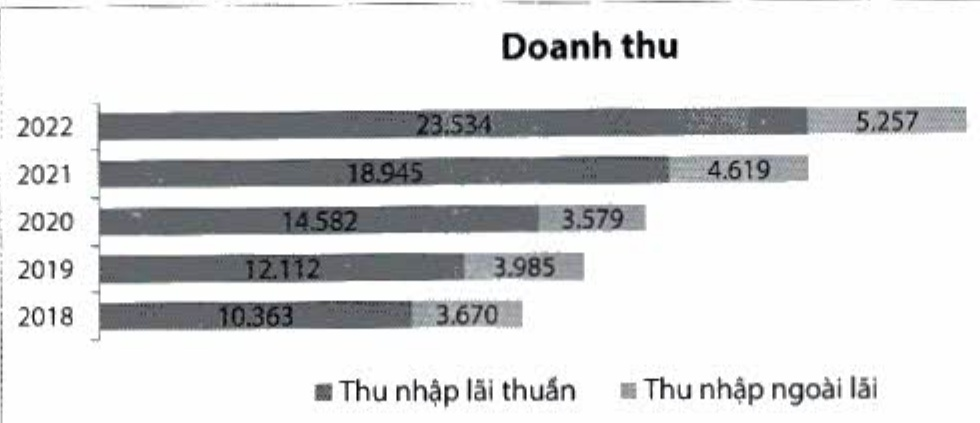

- Thu nhập ngoài lãi năm 2022 tăng 14%, đạt gần 5,3 nghìn tỷ đồng, đóng góp 18% trên tồng doanh thu. Thu nhập từ hoạt động đầu tư chứng khoản giảm do thanh khoản thị trường sụt giảm mạnh. Thu nhập phí tăng trưởng tốt 22% so với cùng kỳ, nhờ các loại phí chủ lực gồm đại lý bảo hiểm nhân thọ, thẻ và thanh toán quốc tế.

Doanh thu từ hoạt động đại lý bảo hiểm nhân thọ động góp tỷ trọng lớn trong thu nhập phi với tỷ lệ 55%, đạt gần 2 nghìn tỷ đồng, tăng trưởng 31% so với năm 2021.

- Hoạt động kinh doanh thê tăng trường mạnh mẽ ở mức 86% so với năm 2021, chủ yếu đến từ các dòng thể tín dụng quốc tế cao cấp (Visa Platinum, Visa Signature) và dòng thể ghi ngờ. Với các dòng thể chủ lực trên, doanh số chi tiêu thê tăng 64% so với năm trước và số lượng thê phát hành mới tăng 58% so với năm 2021.

- Hoạt động thanh toán quốc tế động góp tỷ trọng lớn thứ ba, chiếm 11% trong tổng phí dịch vụ. Hoạt động xuất nhập khẩu năm 2022 của cả nước tiếp tục đạt kỹ lực mới về mặt quy mô, với kim ngạch xuất nhập khẩu đạt con số hơn 700 tỷ USD. Nhờ đó, doanh số thanh toán quốc tế của ACB đạt mức tăng trưởng cao 24% so với năm 2021, đạt 11,7 tỷ USD.

#### 2.2.2. Chi phí hoạt động

- Chỉ phí hoạt động của Ngân hàng tới cuối năm 2022 gần 12 nghìn tỷ đồng, tăng 41% so với cùng kỳ, chủ yếu do trích lập bổ sung Quỹ Khoa học và công nghệ. Nếu không gồm các khoản chi phí này, chi phí hoạt động chi tăng 29% so với cùng kỳ, do tăng chi phí cho nhân viên cũng như tăng chi phí phục vụ kinh doanh như hội nghị, công tác phí, chi phí truyền thông, khuyến mại, chăm sóc khách hàng, v.v. Tỷ lệ CIR cuối năm ở mức 40%.

<table border=1 style='margin: auto; word-wrap: break-word;'><tr><td style='text-align: center; word-wrap: break-word;'>Chi tiêu (ĐVT: tỷ đồng)</td><td style='text-align: center; word-wrap: break-word;'>2022</td><td style='text-align: center; word-wrap: break-word;'>2021</td><td style='text-align: center; word-wrap: break-word;'>% tăng giảm</td><td style='text-align: center; word-wrap: break-word;'>Tỷ trọng 2022 (%)</td></tr><tr><td style='text-align: center; word-wrap: break-word;'>Chi nộp thuế và các khoản phí, lệ phí</td><td style='text-align: center; word-wrap: break-word;'>14</td><td style='text-align: center; word-wrap: break-word;'>11</td><td style='text-align: center; word-wrap: break-word;'>35</td><td style='text-align: center; word-wrap: break-word;'>0</td></tr><tr><td style='text-align: center; word-wrap: break-word;'>Chi phí cho nhân viên</td><td style='text-align: center; word-wrap: break-word;'>6.069</td><td style='text-align: center; word-wrap: break-word;'>5.129</td><td style='text-align: center; word-wrap: break-word;'>18</td><td style='text-align: center; word-wrap: break-word;'>52</td></tr><tr><td style='text-align: center; word-wrap: break-word;'>Chi về tài sản</td><td style='text-align: center; word-wrap: break-word;'>1.734</td><td style='text-align: center; word-wrap: break-word;'>1.692</td><td style='text-align: center; word-wrap: break-word;'>2</td><td style='text-align: center; word-wrap: break-word;'>15</td></tr><tr><td style='text-align: center; word-wrap: break-word;'>Chi cho hoạt động quản lý công vũ</td><td style='text-align: center; word-wrap: break-word;'>3.287</td><td style='text-align: center; word-wrap: break-word;'>1.737</td><td style='text-align: center; word-wrap: break-word;'>89</td><td style='text-align: center; word-wrap: break-word;'>28</td></tr><tr><td style='text-align: center; word-wrap: break-word;'>Chi nộp phí bảo hiểm, bảo toàn tiền gửi của khách hàng</td><td style='text-align: center; word-wrap: break-word;'>455</td><td style='text-align: center; word-wrap: break-word;'>420</td><td style='text-align: center; word-wrap: break-word;'>9</td><td style='text-align: center; word-wrap: break-word;'>4</td></tr><tr><td style='text-align: center; word-wrap: break-word;'>Chi phí dự phòng giảm giá các khoản đầu tư dài hạn và dự phòng nợ khó đòi</td><td style='text-align: center; word-wrap: break-word;'>45</td><td style='text-align: center; word-wrap: break-word;'>(758)</td><td style='text-align: center; word-wrap: break-word;'>-106</td><td style='text-align: center; word-wrap: break-word;'>0</td></tr><tr><td style='text-align: center; word-wrap: break-word;'>Tổng cộng</td><td style='text-align: center; word-wrap: break-word;'>11.605</td><td style='text-align: center; word-wrap: break-word;'>8.230</td><td style='text-align: center; word-wrap: break-word;'>41</td><td style='text-align: center; word-wrap: break-word;'>100%</td></tr></table>