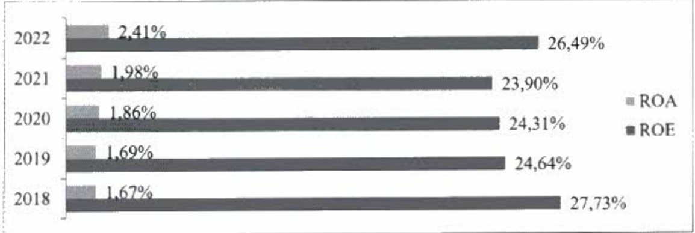
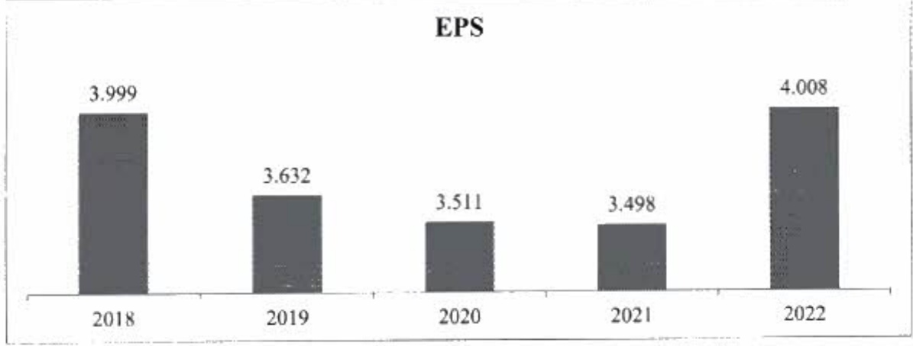

#### 2.2.3. Chi phí dự phòng

- Chỉ phí dự phòng rùi ro tín dụng giảm còn 71 tỷ đồng, giảm 98% so với cùng kỳ năm trước, chủ yếu nhờ hoàn nhập dự phòng từ khách hàng bị ảnh hưởng bởi dịch Covid-19 đã phục hồi năng lực tài chính. Tỷ lệ bao phủ nợ xấu chiếm 159%, đầy là mức cao trong ngành.

#### 2.2.4. Tỷ suất lợi nhuận, lãi cơ bản mỗi cổ phiếu

- ACB vẫn duy trì được tỷ suất lợi nhuận cao hàng đầu trong ngành. Nhiều năm liền, ACB có ROE trên 20%; và đạt 26,50% trong năm 2022. ROA tiếp tục tăng qua các năm, cuối năm 2022 đạt 2,4%.

EPS hiện đạt mức 4.008 đồng/cô phiếu, tăng so với EPS năm 2021 (3.498 đồng/cô phiếu).

