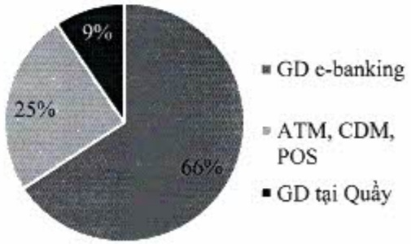
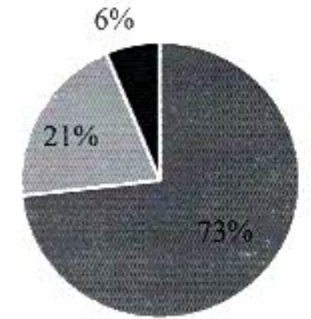

cấu giao dịch tiếp tục dịch chuyển mạnh từ kênh truyền thống sang kênh diện tử. Theo đó, tỷ lệ giao dịch điện tử tăng từ 66% lên 73%, giao dịch tại quầy chỉ còn 6% tính đến cuối năm 2022 cho thấy xu hướng ngân hàng số đang dần trở thành kênh giao dịch phổ biến.

Cơ cấu giao dịch 2021

Cơ cấu giao dịch 2022

Hoạt động ngân hàng số sẽ được nâng cao như sau:

Phát triển quan hệ hợp tác và kết nối với các công ty có hệ sinh thái số đề cùng khai thác danh mục khách hàng, đồng thời tiếp tục nâng cấp công nghệ cũng như khai thác nền tảng số của các đối tác liên kết để phát triển khách hàng mới.

- Triển khai khu vực dành riêng cho các dịch vụ đầu tư liên kết với ACBS trên các kênh ngân hàng số để khách hàng có thể mở tài khoản đầu tư chứng khoản, xem danh mục đầu tư, liên kết tài khoản ACB với tài khoản đầu tư chứng khoản.

Xây dựng năng lực tiếp thị tự động (automation marketing) thông qua các kênh ngân hàng số để gửi các thông điệp bán hàng được cá nhân hóa đến đúng đối tượng khách hàng phù hợp.

5. Giải trình của Ban điều hành đối với ý kiến kiểm toán

Công ty KPMG không có ý kiến không chấp thuận đối với báo cáo tài chính của ACB.

6. Báo cáo đánh giá liên quan đến trách nhiệm về môi trường và xã hội

6.1. Đánh giá liên quan đến các chỉ tiêu môi trường

6.2. Đánh giá liên quan đến vấn đề người lao động

6.3. Đánh giá liên quan đến trách nhiệm xã hội của ACB đối với công đồng địa phương

Mục 6 này: Xin xem Chương IX "Báo cáo phát triển bền vững."