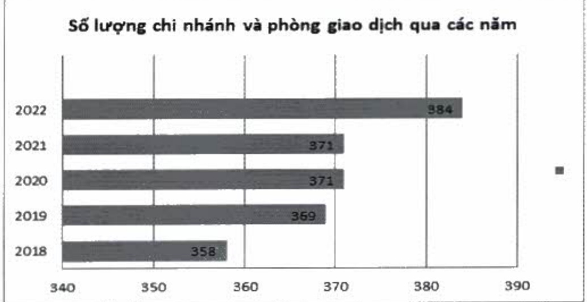
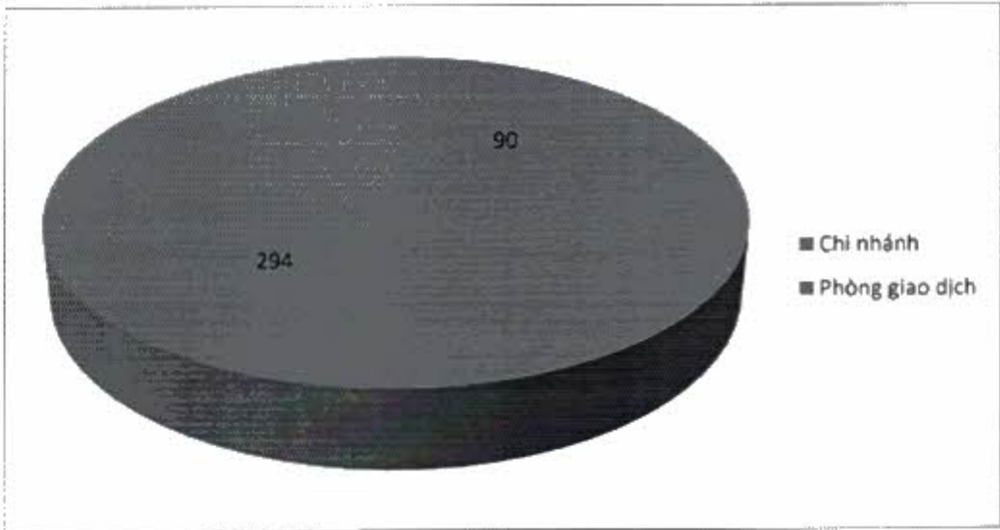

### VIII. MẠNG LƯỚI CHI NHÁNH VÀ PHÒNG GIAO DỊCH

Tính đến cuối năm 2022, ACB có 90 CN và 294 PGD, tổng cộng là 384 đơn vị, hiện diện trên 49

tính thành trong số 63 tính thành cá nước. CN và PGD của ACB tập trung chủ yếu tại TP. Hồ Chí Minh và Hà Nội.

Số lượng chỉ nhánh và phòng giao dịch trong năm năm qua

Số lượng chi nhánh và phòng giao dịch cuối năm 2022

