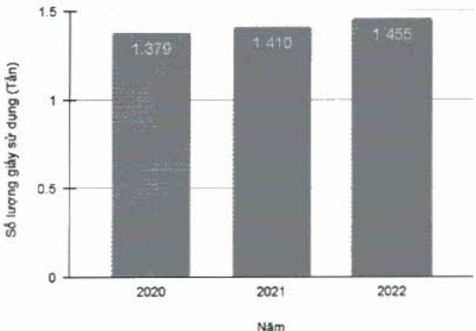

Tổng lượng giấy đã sử dụng theo năm

Lượng giấy sử dụng tăng tù 1.379 tấn vào năm 2020 lên lần lượt là 1.410 tấn và 1.455 tấn trong năm 2021 và 2022, tương ứng với tỷ lệ tăng tùng năm là 2.20% và 3%.

Giấy sử dụng tại ACB được mua từ nhà cung cấp bên ngoài bao gồm các loại giấy in cho hợp đồng, văn bản; giấy có logo ACB để sử dụng giao dịch như biên lai thu tiền, ủy nhiệm chi và các ấn phẩm như lịch và sở tay.

+ Tuy lượng giấy sử dụng tại ACB có tăng nhẹ trong năm 2022 do hoạt động kinh doanh của ACB đã phục hồi và phát triển trong năm 2022 sau thời gian bị ảnh hưởng bởi dịch Covid-19, nhưng mục tiêu sử dụng tiết kiệm sử dụng giấy luôn được ACB đầy mạnh thực hiện trong năm 2022.

#### Giấy tiết kiệm

Hàng tấn giấy được ACB tiết kiệm trong năm 2022 do liên tục thực hiện số hóa quy trình theo các chương trình Gần Lại O, như Green Transactions, Go Paperless Credit, v.v., cụ thể là ACB đã tiết kiệm khoảng 204 tấn giấy, tăng 53% so với 133 tấn giấy của năm 2021.

(ĐVT: tần)

<table border=1 style='margin: auto; word-wrap: break-word;'><tr><td style='text-align: center; word-wrap: break-word;'>Số lượng</td><td style='text-align: center; word-wrap: break-word;'>2021</td><td style='text-align: center; word-wrap: break-word;'>2022</td></tr><tr><td style='text-align: center; word-wrap: break-word;'>Giấy tiết kiệm</td><td style='text-align: center; word-wrap: break-word;'>133</td><td style='text-align: center; word-wrap: break-word;'>204</td></tr></table>