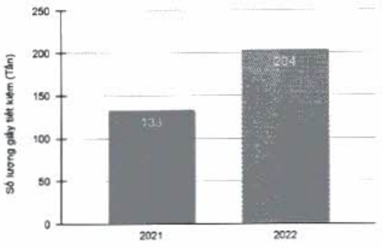
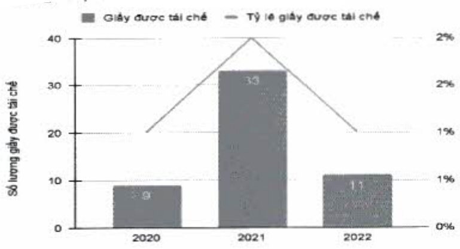

Tổng lượng giấy tiết kiệm theo năm

Bên cạnh đó, lượng giấy đã qua sử dụng cần tiêu hủy sẽ được ACB tái chế để sử dụng nhiều lần, qua đó giám được lượng rác thải từ giấy.

#### Giấy được tái chế

Đối với các chứng từ cần tiêu hủy, ACB đã chuyển cho các nhà máy giấy để cất nhỏ, phần loại và mang đi tái chế.

(ĐVT: tần)

<table border=1 style='margin: auto; word-wrap: break-word;'><tr><td style='text-align: center; word-wrap: break-word;'>Số lượng</td><td style='text-align: center; word-wrap: break-word;'>2020</td><td style='text-align: center; word-wrap: break-word;'>2021</td><td style='text-align: center; word-wrap: break-word;'>2022</td></tr><tr><td style='text-align: center; word-wrap: break-word;'>Giấy được tái chế</td><td style='text-align: center; word-wrap: break-word;'>9</td><td style='text-align: center; word-wrap: break-word;'>33</td><td style='text-align: center; word-wrap: break-word;'>11</td></tr><tr><td style='text-align: center; word-wrap: break-word;'>Tỷ lệ giấy được tái chế (%)</td><td style='text-align: center; word-wrap: break-word;'>1</td><td style='text-align: center; word-wrap: break-word;'>2</td><td style='text-align: center; word-wrap: break-word;'>1</td></tr></table>

Tổng lượng giấy tái chế theo năm

