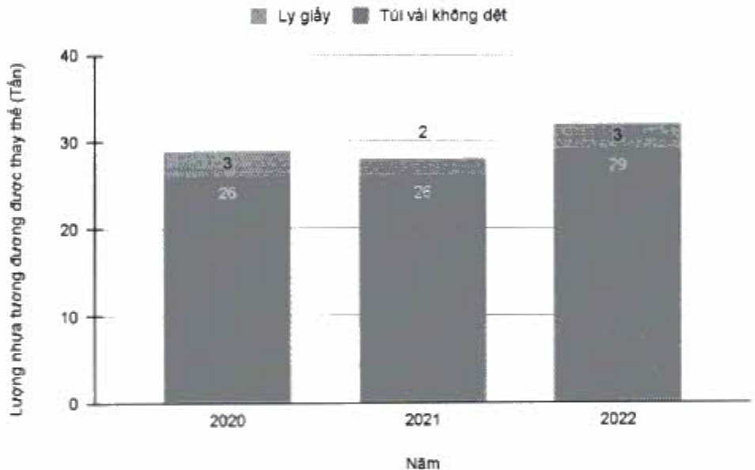

Tỷ lệ giấy được tái chế văn được duy trì mức 1% so với tổng lượng giấy tiêu thụ tại ACB.

#### Hạn chế sử dụng vật liệu nhựa

Hầu hết các vật dụng bằng nhựa tại ACB đều được thay bằng các vật liệu thân thiện môi trường; ví dụ như túi vải thay cho túi nhựa; ly giấy thay cho ly nhựa; ly thủy tinh dùng trong phòng hợp thay vì chai nhựa trong suốt (PET); bao dựng lịch tăng cho khách hàng, đối tác được làm bằng giấy thay cho nhựa, v.v. Hành động này làm giảm đáng kể lượng nhựa đang tiêu thụ tại ACB với khoảng 89 tấn nhựa tương đương đã được ACB thay thế trong ba năm bằng các vật liệu như ly giấy và túi vải không đặt, cụ thể với số liệu sau:

(ĐVT: tấn)

<table border=1 style='margin: auto; word-wrap: break-word;'><tr><td style='text-align: center; word-wrap: break-word;'>Số lượng nhựa tương đương được thay thế</td><td style='text-align: center; word-wrap: break-word;'>2020</td><td style='text-align: center; word-wrap: break-word;'>2021</td><td style='text-align: center; word-wrap: break-word;'>2022</td></tr><tr><td style='text-align: center; word-wrap: break-word;'>Túi vài không đệt</td><td style='text-align: center; word-wrap: break-word;'>26</td><td style='text-align: center; word-wrap: break-word;'>26</td><td style='text-align: center; word-wrap: break-word;'>29</td></tr><tr><td style='text-align: center; word-wrap: break-word;'>Lấy giấy</td><td style='text-align: center; word-wrap: break-word;'>3</td><td style='text-align: center; word-wrap: break-word;'>2</td><td style='text-align: center; word-wrap: break-word;'>3</td></tr><tr><td style='text-align: center; word-wrap: break-word;'>Tổng</td><td style='text-align: center; word-wrap: break-word;'>29</td><td style='text-align: center; word-wrap: break-word;'>28</td><td style='text-align: center; word-wrap: break-word;'>32</td></tr></table>

Tổng lượng nhựa tương đương đã được thay thế theo năm

Ngoài ra, thay vì mua vật dụng có tỷ lệ nhựa cao như thăm sàn cho các tòa nhà lớn, thi ACB mua thăm tái chế từ lưới đánh cá cũ của ngư dân, góp phần giảm thiếu sử dụng nhựa và lượng khí nhà kính.