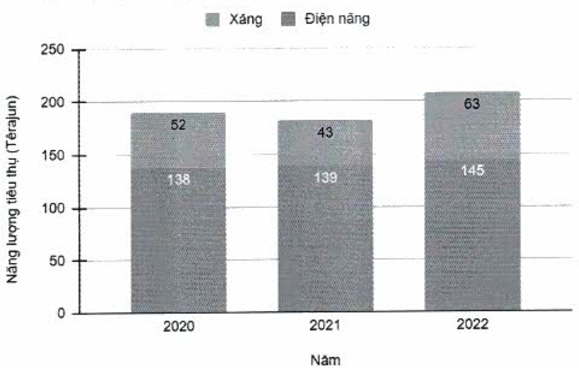

+ Trong tương lai, ACB dự kiến sẽ sử dụng vấn tay để thay thế cho thế nhân viên hiện đang làm bằng nhựa để giảm thiếu hơn nữa lượng nhựa sử dụng.

#### 2.3.2. Tiêu thụ năng lượng

ACB hướng đến mục tiêu tiết giảm nặng lượng tiêu thụ.

Nguồn năng lượng tiêu thụ tại ACB bao gồm hai loại chính là điện năng sử dụng để vận hành cho các hoạt động và xăng sử dụng cho các phương tiện vận chuyển.

(ĐVT: Têrajun)

<table border=1 style='margin: auto; word-wrap: break-word;'><tr><td style='text-align: center; word-wrap: break-word;'>Loại năng lượng</td><td style='text-align: center; word-wrap: break-word;'>2020</td><td style='text-align: center; word-wrap: break-word;'>2021</td><td style='text-align: center; word-wrap: break-word;'>2022</td></tr><tr><td style='text-align: center; word-wrap: break-word;'>Điện năng $ ^{(1)} $</td><td style='text-align: center; word-wrap: break-word;'>138</td><td style='text-align: center; word-wrap: break-word;'>139</td><td style='text-align: center; word-wrap: break-word;'>145</td></tr><tr><td style='text-align: center; word-wrap: break-word;'>Xăng $ ^{(2)} $</td><td style='text-align: center; word-wrap: break-word;'>52</td><td style='text-align: center; word-wrap: break-word;'>43</td><td style='text-align: center; word-wrap: break-word;'>63</td></tr><tr><td style='text-align: center; word-wrap: break-word;'>Tổng</td><td style='text-align: center; word-wrap: break-word;'>190</td><td style='text-align: center; word-wrap: break-word;'>182</td><td style='text-align: center; word-wrap: break-word;'>208</td></tr></table>

Tổng lượng năng lượng đã tiêu thụ theo năm

(1) Điện năng tiêu thụ của Tập đoàn ACB.

(2) Xăng tiêu thụ của Ngân hàng ACB, không bao gồm các công ty con.

+ Do tăng nhu cầu tiêu thụ điện và xăng, nên so với năm 2021 và năm 2020, lượng năng lượng tiêu thụ tăng trong năm 2022 lần lượt là 14,30% và 9,50%. Lượng năng lượng từ