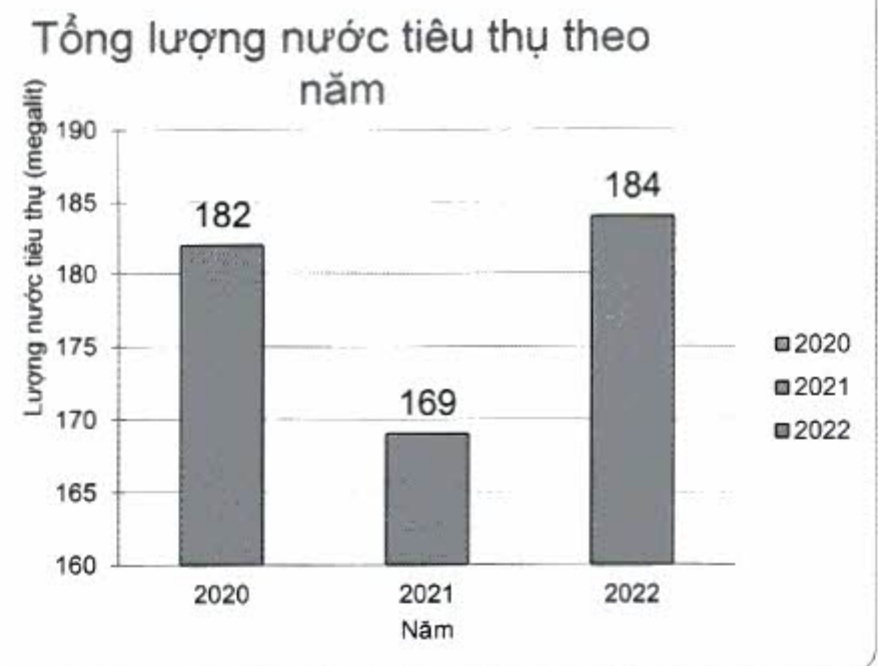

#### 2.3.3. Tiêu thụ nước

ACB xây dựng và để cao ý thức sử dụng tiết kiệm nước trong nhân viên.

Nước tiêu thụ tại ACB được mua từ nguồn cấp nước đô thị và dùng cho sinh hoạt hàng ngày của nhân viên ACB, chi tiết:

(DVT: megalit)

<table border=1 style='margin: auto; word-wrap: break-word;'><tr><td style='text-align: center; word-wrap: break-word;'></td><td style='text-align: center; word-wrap: break-word;'>2020</td><td style='text-align: center; word-wrap: break-word;'>2021</td><td style='text-align: center; word-wrap: break-word;'>2022</td></tr><tr><td style='text-align: center; word-wrap: break-word;'>Lương nước tiêu thụ (megalit) $ ^{(1)} $</td><td style='text-align: center; word-wrap: break-word;'>182</td><td style='text-align: center; word-wrap: break-word;'>169</td><td style='text-align: center; word-wrap: break-word;'>184</td></tr></table>

Lượng nước tiêu thụ được tổng hợp thống kê số liệu từ Tập đoàn ACB.

So với năm 2021 và năm 2020, tổng lượng nước tiểu thư tăng năm 2022 lần lượt là 8,90% và 1,10%. Tổng lượng nước tiểu thư tăng từ tiểu thư 169 megalít trong năm 2021 và 182 megalít trong năm 2020 lên đến 184 megalít trong năm 2022.

Lượng nước tiêu thụ tại ACB có xu hướng tăng nhẹ qua các năm và đặc biệt là trong năm 2022 là do ACB đã hoàn toàn phục hồi các hoạt động, vốn bị giảm sút do tác động của dịch Covid-19 trong năm 2020 và 2021. Số lượng nước tiêu thụ trong năm 2022 gia tăng một phần là do mở rộng mạng lưới kênh phân phối, cụ thể là 11 chi nhánh, phòng giao dịch được mở mới và có thêm nhân sự làm việc tại Hội sở.

Mặc dù phải tiêu thụ nhiều nước hơn cho phục hồi và phát triển hoạt động, nhưng ACB luôn xây