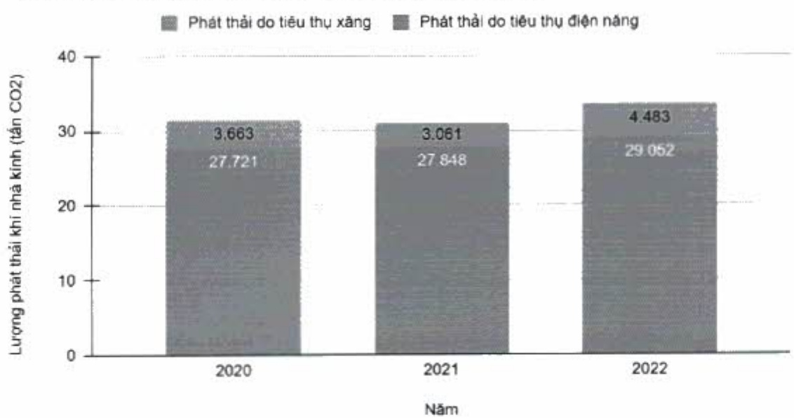

dụng và đề cao ý thức sử dụng tiết kiệm nước trong nhân viên ACB thông qua các bản tin gửi đến nhân viên.

#### 2.3.4. Phát thải khí nhà kính

ACB sử dụng năng lượng hợp lý và thực hiện các biện pháp trung hòa, góp phần giảm phát thải khí nhà kinh.

Nguồn phát thải khí nhà kính từ ACB vào môi trường chủ yếu đến từ hai loại năng lượng đang được sử dụng là điện và xăng, chi tiết như băng bên dưới:

(ĐVT: tần CO2)

<table border=1 style='margin: auto; word-wrap: break-word;'><tr><td style='text-align: center; word-wrap: break-word;'>Nguồn phát thải</td><td style='text-align: center; word-wrap: break-word;'>2020</td><td style='text-align: center; word-wrap: break-word;'>2021</td><td style='text-align: center; word-wrap: break-word;'>2022</td></tr><tr><td style='text-align: center; word-wrap: break-word;'>Diện năng $ ^{(1)} $</td><td style='text-align: center; word-wrap: break-word;'>27.721</td><td style='text-align: center; word-wrap: break-word;'>27.848</td><td style='text-align: center; word-wrap: break-word;'>29.052</td></tr><tr><td style='text-align: center; word-wrap: break-word;'>Xăng $ ^{(2)} $</td><td style='text-align: center; word-wrap: break-word;'>3.663</td><td style='text-align: center; word-wrap: break-word;'>3.061</td><td style='text-align: center; word-wrap: break-word;'>4.483</td></tr><tr><td style='text-align: center; word-wrap: break-word;'>Tổng</td><td style='text-align: center; word-wrap: break-word;'>31.384</td><td style='text-align: center; word-wrap: break-word;'>30.909</td><td style='text-align: center; word-wrap: break-word;'>33.535</td></tr></table>

Tổng lượng phát thải khí nhà kinh theo năm

Phát thái do tiêu thụ điện năng được thống kê tổng hợp số liệu từ Tập đoàn ACB

Phát thải do tiêu thụ xăng được thống kê tổng hợp số liệu của Ngân hàng ACB, không bao gồm các công ty con.