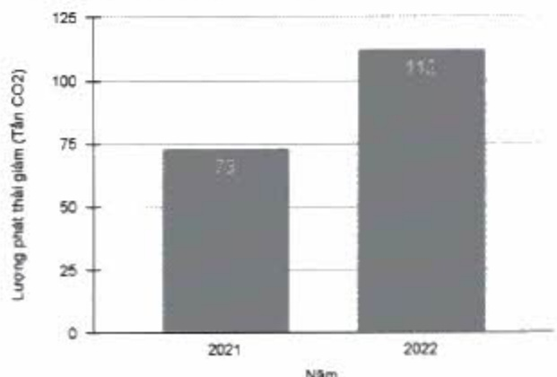

(ĐVT: tần CO₂)

<table border=1 style='margin: auto; word-wrap: break-word;'><tr><td style='text-align: center; word-wrap: break-word;'>Các biện pháp giảm phát thải (tần  $ CO_{2} $)</td><td style='text-align: center; word-wrap: break-word;'>2021</td><td style='text-align: center; word-wrap: break-word;'>2022</td></tr><tr><td style='text-align: center; word-wrap: break-word;'>Tiết kiệm giấy</td><td style='text-align: center; word-wrap: break-word;'>73</td><td style='text-align: center; word-wrap: break-word;'>112</td></tr></table>

Lượng phát thải giảm theo năm

##### Trung hòa carbon:

Lượng phát thải khí nhà kinh phát sinh trong hoạt động vận hành hàng ngày, nhất là khí CO₂, là không thể tránh khỏi, nên ACB chủ trọng thực hiện các biện pháp trung hòa carbon bằng cách loại bỏ carbon hoặc đền bù carbon. Trong năm 2022, khoảng 182 tấn CO₂ tương đương đã được ACB đền bù thông qua sử dụng thảm tái chế và các chương trình Gần lại O.

(ĐVT: tần CO₂)

<table border=1 style='margin: auto; word-wrap: break-word;'><tr><td style='text-align: center; word-wrap: break-word;'>Các biện pháp trung hòa</td><td style='text-align: center; word-wrap: break-word;'>2022</td></tr><tr><td style='text-align: center; word-wrap: break-word;'>Thảm tái chế</td><td style='text-align: center; word-wrap: break-word;'>181</td></tr><tr><td style='text-align: center; word-wrap: break-word;'>Thu gom rác, tái chế giấy và trồng cây xanh</td><td style='text-align: center; word-wrap: break-word;'>1</td></tr><tr><td style='text-align: center; word-wrap: break-word;'>Tổng</td><td style='text-align: center; word-wrap: break-word;'>182</td></tr></table>

#### Bảng Tổng lượng trung hòa carbon năm 2022

Thăm tái chế từ lưới đánh cá là loại thăm trong Chương trình Thăm trung hòa carbon (The Carbon Neutral Floors) được chứng nhận tiêu chuẩn PAS 2060 của Viện Tiêu chuẩn Anh về nỗ lực quản lý và giảm phát thải khí nhà kính. ACB đã dùng loại thăm này cho các tòa nhà lớn của mình.