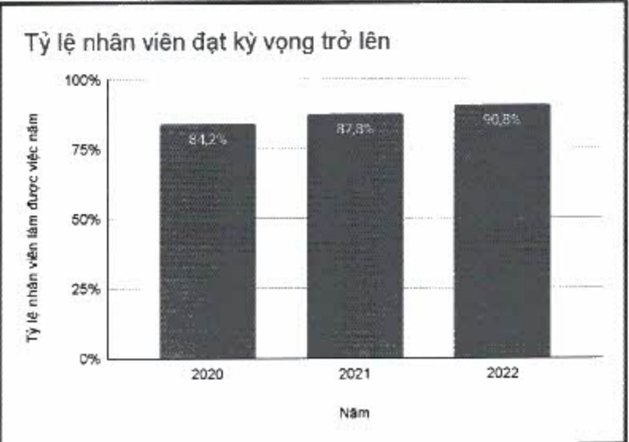

- ACB cũng giới hạn tỷ lệ nghĩ của nhóm đạt kỳ vọng trở lên dưới 10%/năm. Trong năm 2022, tỷ lệ nhóm nhân viên đạt kỳ vọng trở lên thôi việc là 9,80%. ACB đã xây dựng chính sách, cơ chế và lộ trình tác động kịp thời, tích cực đến nhóm nhân viên thường xuyên không đạt yêu cầu.

<table border=1 style='margin: auto; word-wrap: break-word;'><tr><td style='text-align: center; word-wrap: break-word;'></td><td style='text-align: center; word-wrap: break-word;'>2020</td><td style='text-align: center; word-wrap: break-word;'>2021</td><td style='text-align: center; word-wrap: break-word;'>2022</td></tr><tr><td style='text-align: center; word-wrap: break-word;'>Tỷ lệ nhân viên đạt kỳ vọng trở lên (*)</td><td style='text-align: center; word-wrap: break-word;'>84,20%</td><td style='text-align: center; word-wrap: break-word;'>87,80%</td><td style='text-align: center; word-wrap: break-word;'>90,80%</td></tr></table>

(*) Tý lệ nhân viên đạt kỳ vọng trở lên của Ngân hàng ACB, không bao gồm các công ty con.

(*) Tỷ lệ nhân viên đạt kỳ vọng trở lên của Ngân hàng ACB, không bao gồm các công ty con.

#### 3.2.2. Đào tạo và phát triển

ACB thường xuyên cấp nhất, nâng cao kiến thức nghiệp vụ chuyên môn cho người lao động trong lĩnh vực phụ trách để họ làm chủ công việc và có cơ hội thắng tiến.

Trình độ học vấn của nhân viên ACB:

<table border=1 style='margin: auto; word-wrap: break-word;'><tr><td style='text-align: center; word-wrap: break-word;'>Trình độ học vấn</td><td style='text-align: center; word-wrap: break-word;'>Số lượng (nhân viên)</td><td style='text-align: center; word-wrap: break-word;'>Tỷ trọng (%)</td></tr><tr><td style='text-align: center; word-wrap: break-word;'>Đại học</td><td style='text-align: center; word-wrap: break-word;'>11.978</td><td style='text-align: center; word-wrap: break-word;'>91,89</td></tr><tr><td style='text-align: center; word-wrap: break-word;'>Sau đại học</td><td style='text-align: center; word-wrap: break-word;'>411</td><td style='text-align: center; word-wrap: break-word;'>3,15</td></tr><tr><td style='text-align: center; word-wrap: break-word;'>Khác</td><td style='text-align: center; word-wrap: break-word;'>646</td><td style='text-align: center; word-wrap: break-word;'>4,96</td></tr><tr><td style='text-align: center; word-wrap: break-word;'>Tổng công</td><td style='text-align: center; word-wrap: break-word;'>13.035</td><td style='text-align: center; word-wrap: break-word;'>100</td></tr></table>