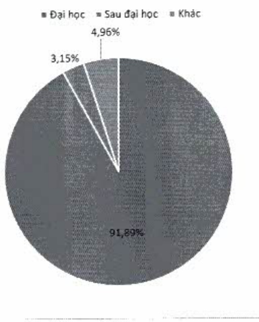

Tỷ trọng nhân viên theo trình độ học vấn

……

##### Đào tạo

Chương trình đào tạo của ACB được lên kế hoạch và tổ chức hàng năm dựa trên các quy định bắt buộc của NHNN, tính chất công việc của các phòng ban, vị trí và nguyên vọng của nhân viên. Các khóa học được phân nhóm như sau: khóa học theo quy định của NHNN, khóa học về quản lý con người, khóa học nâng cao năng lực chuyển đổi số, v.v. Đặc biệt trong năm 2022, ACB dạy mạnh các khoá học liên quan đến nội dung chuyển đổi số liên kết với các đơn vị cấp chứng chỉ uy tín, đáp ứng mục tiêu và định hướng ngân hàng số.

Tại ACB, hàng năm mỗi nhân viên phải hoàn thành ít nhất 48 giờ học và được ghi nhận như một trong các KPI học tập. Bên cạnh đó, ACB khuyến khích nhân viên tham gia da dạng các hình thức nâng cao năng lực và tích lũy điểm số thi đua trên nền tảng ACB Talent Ecosystem (ATE). Các phần thương và dãi ngộ tương ứng sẽ do nhân viên quy đổi dựa vào điểm số tích lũy của từng cá nhân.

Năm 2022 đánh dấu hoạt động học tập mạnh mẽ của nhân viên ACB với tổng số giờ học của tổ chức hơn 760.105 giờ. Nhân viên toàn hệ thống tham gia các hoạt động học tập với số ngày học trung bình 10,5 ngày/nhân viên/năm, so với chính ngày của năm 2021.

Ngân sách cho đào tạo bao gồm học phí, chỉ phí tổ chức các lớp học và các khoản chỉ phi liên quan khác tăng liên tục qua các năm. Cụ thể, tổng ngân sách đào tạo tăng đến 85% trong năm 2021 và tiếp tục đà tăng 4% trong năm 2022.

#### Số giờ đào tạo/học trung bình mỗi năm

Năm 2022, nhân viên ACB có tổng số giờ học là 760.105 giờ, tăng 17% so với năm 2021. Theo đó, số giờ học trung bình toàn hệ thống và theo phân nhóm như sau: