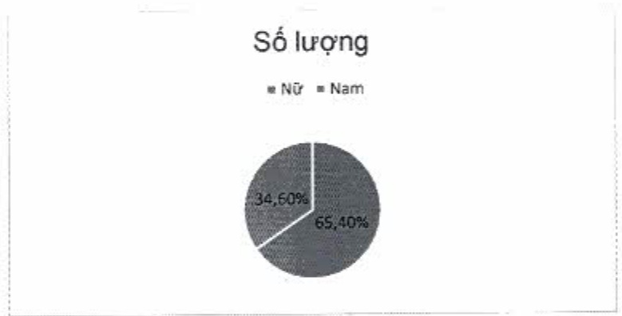
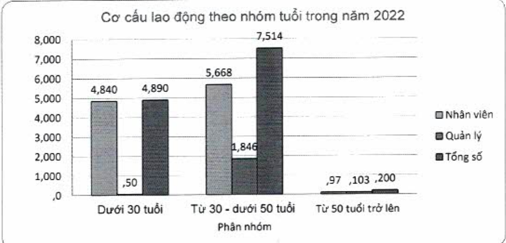

<table border=1 style='margin: auto; word-wrap: break-word;'><tr><td style='text-align: center; word-wrap: break-word;'>Cơ cấu lao động theo nhóm tuổi(*)</td><td style='text-align: center; word-wrap: break-word;'>Nhân viên</td><td style='text-align: center; word-wrap: break-word;'>Quản lý</td><td style='text-align: center; word-wrap: break-word;'>Tổng số</td></tr><tr><td style='text-align: center; word-wrap: break-word;'>Dưới 30 tuổi</td><td style='text-align: center; word-wrap: break-word;'>4.840</td><td style='text-align: center; word-wrap: break-word;'>50</td><td style='text-align: center; word-wrap: break-word;'>4.890</td></tr><tr><td style='text-align: center; word-wrap: break-word;'>Từ 30 - dưới 50 tuổi</td><td style='text-align: center; word-wrap: break-word;'>5.668</td><td style='text-align: center; word-wrap: break-word;'>1.846</td><td style='text-align: center; word-wrap: break-word;'>7.514</td></tr><tr><td style='text-align: center; word-wrap: break-word;'>Từ 50 tuổi trở lên</td><td style='text-align: center; word-wrap: break-word;'>97</td><td style='text-align: center; word-wrap: break-word;'>103</td><td style='text-align: center; word-wrap: break-word;'>200</td></tr><tr><td style='text-align: center; word-wrap: break-word;'>Tổng cộng</td><td style='text-align: center; word-wrap: break-word;'>10.605</td><td style='text-align: center; word-wrap: break-word;'>1.999</td><td style='text-align: center; word-wrap: break-word;'>12.604</td></tr></table>

(⁶) Cơ cấu lao động theo nhóm tuổi của Ngân hàng ACB, không bao gồm các công ty con

(⁹) Cơ cấu lao động theo nhóm tuổi của Ngân hàng ACB, không bao gồm các công ty con

#### 3.2.4. Đãi ngộ

Các chế độ dãi ngộ có tham chiếu thị trường và luôn được điều chỉnh, nâng cao, thực hiện công bằng và minh bạch.