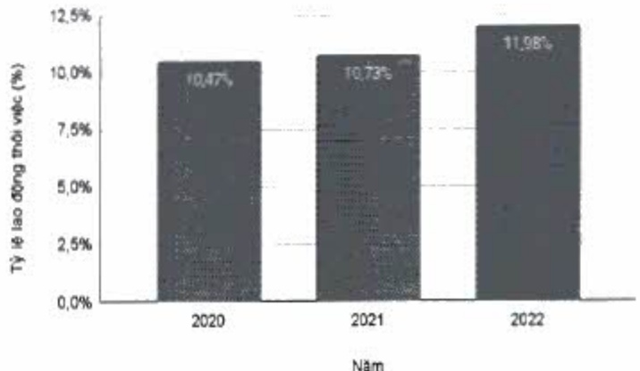

<table border=1 style='margin: auto; word-wrap: break-word;'><tr><td style='text-align: center; word-wrap: break-word;'></td><td style='text-align: center; word-wrap: break-word;'>2020</td><td style='text-align: center; word-wrap: break-word;'>2021</td><td style='text-align: center; word-wrap: break-word;'>2022</td></tr><tr><td style='text-align: center; word-wrap: break-word;'>Tỷ lệ người lao động thôi việc (%)</td><td style='text-align: center; word-wrap: break-word;'>10,47</td><td style='text-align: center; word-wrap: break-word;'>10,73</td><td style='text-align: center; word-wrap: break-word;'>11,98</td></tr></table>

Tỷ lệ lao động thôi việc của Ngân hàng ACB, không bao gồm các công ty con.

Tỷ lệ lao động thời việc qua các năm

Tỷ lệ lao động thôi việc được tổng hợp thống kê số liệu chỉ từ Ngân hàng ACB, không bao gồm các công ty con.

Từ cuối năm 2019, ACB triển khai các chính sách tác động đến nhóm không đạt kỳ vọng nhằm gia tăng chất lượng nhân sự. Với các phức lợi dành cho nhân viên và chính sách giữ nhân tài, tỷ lệ giữ chân nhân sự có thăm niên trên ba năm là 90%(*).

Tỷ lệ giữ chân nhân sự của Ngân hàng ACB, không bao gồm các công ty con

### 3.3. Thấu hiểu và tập trung vào khách hàng

Tại ACB, tư duy “khách hàng là trọng tâm” được thể hiện như sau:

#### 3.3.1. Trải nghiệm khách hàng

Với định hướng khách hàng là trọng tâm, ACB nỗ lực từng ngày trong hoạt động thiết kế hành trình trải nghiệm mới dành cho phân khúc khách hàng mục tiêu đối với dịch vụ cũng như sản phẩm của ACB. ACB không ngừng cải thiện chất lượng sản phẩm và dịch vụ thông qua việc lắng nghe ý kiến và thấu hiểu như cầu khách hàng.

Trong năm 2022, ACB đã triển khai một số dự án chiến lược liên quan đến quy trình thiết kế trải nghiệm khách hàng, bao gồm bốn bước chính:

Hiệu khách hàng;

(2) Tìm hiểu hành trình hiện tại của khách hàng;

(3) Giải quyết vấn đề khách hàng đưa ra; và