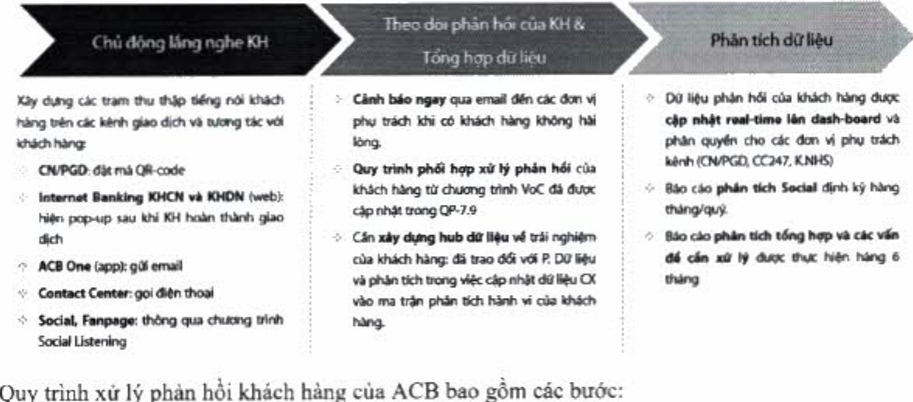

(4) Xây dựng hành trình khách hàng.

#### 3.3.2. Lăng nghe khách hàng

Mức độ hài lòng của khách hàng với ACB được duy trì ở điểm số rất tốt. ACB dành nhiều nguồn lực cho hoạt động thấu hiểu khách hàng (phân tích chân dung, nhu cầu, hành vi tài chính, trải nghiệm của khách hàng tại từng điểm chạm, kênh tương tác, sản phẩm) nhằm thu thập thông tin toàn diện cho hoạt động thiết kế trải nghiệm của khách hàng đối với sản phẩm dịch vụ.

Để đảm bảo phản hồi của khách hàng được tiếp cận và giải quyết kịp thời, triệt để nhằm duy trì, nâng cao chất lượng phục vụ và làm cơ sở cho việc xem xét cải tiến sản phẩm dịch vụ, quy trình, quy định, v.v. ACB đã xây dựng quy trình tiếp nhận phân hồi khách hàng một cách có hệ thống thông qua các kênh trực tiếp tại các chi nhánh, phòng giao dịch hoặc Hội sở ACB, điện thoại, Chat, Email, Văn bản, Chương trình tiếng nói khách hàng (Voice of Customer) và các hình thức tiếp nhất thông tin khác từ cơ quan truyền thông, cơ quan Nhà nước hoặc mạng xã hội.

Nói bật là chương trình Tiếng nói khách hàng (Voice of Customer, gọi tất là "VoC") với các mục đích và hình thức triển khai như sau:

Quy trình xử lý phản hồi khách hàng của ACB có sự phối hợp giữa Trung tâm thế (24/7), chỉ nhánh/phòng giao dịch với đơn vị quản lý nghiệp vụ tại Hội sở.

+ Trung tâm thế (24/7): tiếp nhận và tập trung giải quyết phản hồi liên quan đến thế (áp dụng từ 2022).

+ Khối Ngân hàng số: tiếp nhận và tập trung giải quyết phần hồi liên quan đến ngân hàng