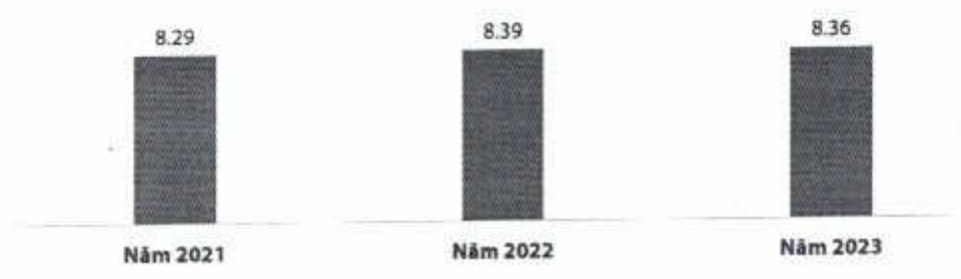
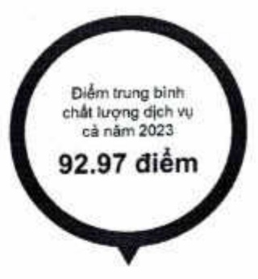
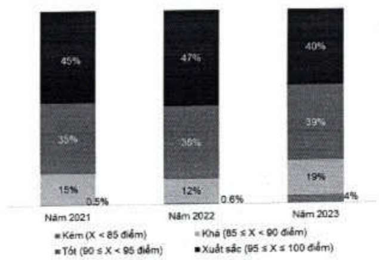

### Số liệu kết quả đo lường trải nghiệm khách hàng 2021 – 2023

Từ năm 2021 đến nay, mặc dù yêu cầu của khách hàng ngày càng cao, ACB vẫn duy trì được mức độ hài lòng của khách hàng ở mức tốt.

Trung bình mục độ hài lòng của KH đối với ACB qua các năm (trên thang điểm 10)

Ghi chú: Mức độ hài lòng của KH với ACB được ghi nhận sau khi KH thực hiện giao dịch tal CN/PGD

Trong năm 2023, chuẩn mực dịch vụ khách hàng được nâng cấp với những tiêu chí đánh giá khất khe hơn nhằm đáp ứng yêu cầu về chất lượng dịch vụ cao. Mặc dù vậy, nhân viên ACB vẫn nỗ lực đáp ứng để duy trì chất lượng dịch vụ ở mức tốt, đạt mục tiêu đề ra của ACB.

Biểu đồ tỷ lệ xếp loại chất lượng dịch vụ đơn vị qua các năm

Ghi chú: kết quả ghi nhân từ chuong trình dành giê mục đó tuần thù chuẩn mực dịch vụ khách hàng thông qua Khách hàng bí mật.

