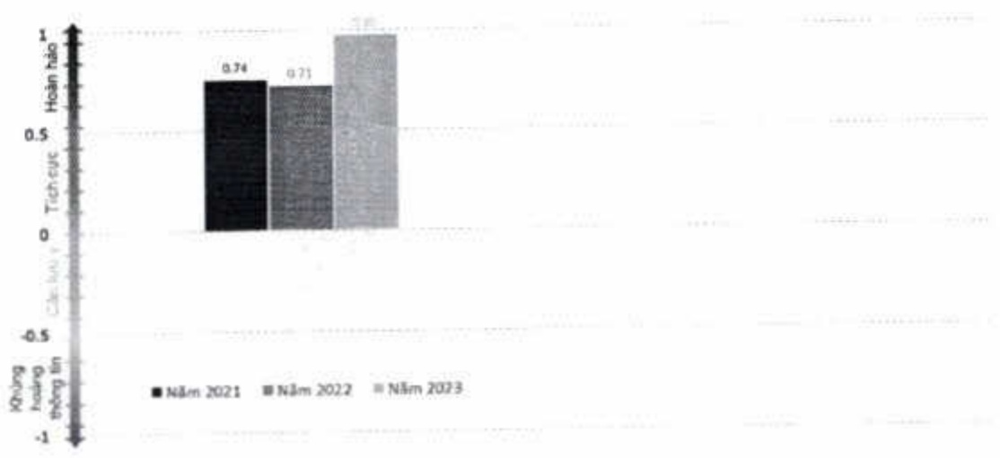

(1) Giám sát thảo luận khách hàng trên trang mạng xã hội do Buzzmetrics thực hiện (tính đến ngày 30/11/2023.)

##### 3.4. Trách nhiệm xã hội

ACB cam kết đồng hành cùng các mục tiêu của Liên hợp quốc về thực thi trách nhiệm xã hội doanh nghiệp đối với môi trường và công đồng địa phương cần hỗ trợ.

Các hoạt động tài trợ giáo dục, xây dựng nhà tinh thưởng, cơ sở vật chất, trường học và hỗ trợ các đối tượng chính sách và người nghèo tiếp tục được ACB thực hiện trong khả năng tài chính của mình.

Trách nhiệm xã hội của ACB được ghi nhận qua giải thưởng Ngân hàng có trách nhiệm xã hội tốt nhất Việt Nam năm 2023 (Best CSR Bank Vietnam 2023) từ Global Finance and Review Banking; TOP 50 Doanh Nghiệp Phát Triển Bền Vững 2023 từ Tạp chí Nhịp Cầu Đầu Tư trao tăng; Best ESG Banking Strategies - Vietnam 2023 từ International Finance Magazine.

Năm 2023, ACB đã dành ngân sách hơn 10,9 tỷ đồng cho các hoạt động cộng đồng xã hội. Ngân sách phần bổ cho các mảng hoạt động như sau:

- Tài trợ các hoạt động giáo dục (chiếm 14%).

- Tài trợ các đối tượng chính sách và người nghèo (chiếm 8%).

- Tài trợ xây dựng nhà tinh thưởng, cơ sở vật chất, trường học (chiếm 49%).

- Tài trợ bảo vệ môi trường, bảo tồn thiên nhiên (chiếm 18%).

- Tài trợ khác (chiếm 11%).

Thống kê số liệu nổi bật