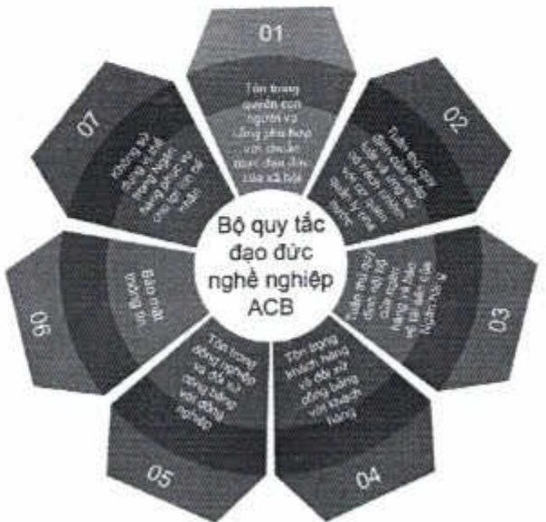
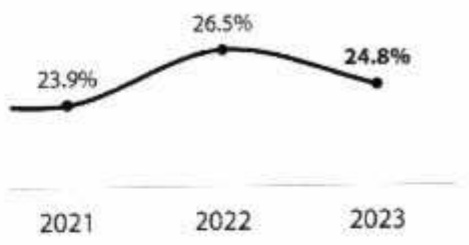

4.3. Phát triển an toàn, hiệu quả và cạnh tranh.

ACB đã chúng mình khả năng phát triển bền vững qua một số chi tiêu như sau:

Tổng tài sản tăng trưởng hàng năm

Tổng tài sản tại ACB liên tục tăng trong giai đoạn ba năm 2021 - 2023. Trong năm 2023, tổng tài sản tại ACB tăng 18%, từ 608 nghìn tỷ đồng trong năm 2022 lên 719 nghìn tỷ đồng.

Năm 2023: 719 nghìn tỷ đồng

Năm 2022: 608 nghìn tỷ đồng

Năm 2021: 528 nghìn tỷ đồng

ROE duy tri ở mức cao

Trong năm 2023, ROE tại ACB đạt 24,8%, hàng đầu trong ngành.

Tỷ suất sinh lời trên vốn chủ sở hữu

Tỷ lệ nợ xấu thấp, tỷ lệ bao phủ nợ xấu cao

Do tinh hình chung của thị trường, trong năm 2023 tỷ lệ nợ xấu ACB có tăng nhẹ so với năm 2022 nhưng vẫn duy trì tỷ lệ nợ xấu thấp nhất trong các ngân hàng thương mại cổ phần. Trong