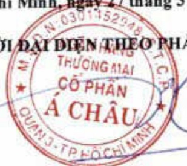

# X. BÁO CÁO TÀI CHÍNH

##### 9.1 Ý kiến kiểm toán

Xin xem Báo cáo kiểm toán độc lập của Công ty TNHH KPMG (Việt Nam) gửi cổ đông Ngân hàng TMCP Á Châu trong Báo cáo tài chính hợp nhất năm 2023 ký ngày 26 tháng 02 năm 2024.

##### 9.2 Báo cáo tài chính được kiểm toán

Xin xem Báo cáo tài chính định kèm.

TP. Hồ Chí Minh, ngày 27 tháng 3 năm 2024

NGƯỜI DẠI ĐIỂN THEO PHÁP LUẬT

Từ Tiến Phát

Nơi nhận:

- NHNN CN TP. HCM.

- Ủy ban Chứng khoán Nhà nước,

Sở GDCK TP. Hồ Chí Minh.

Đính kèm:

Báo cáo tài chính kiểm toán ACB năm 2023 (hợp nhất và riêng).