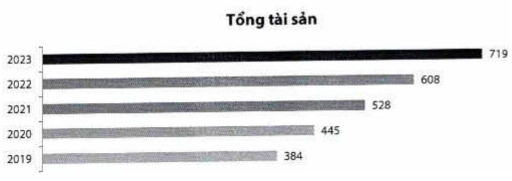
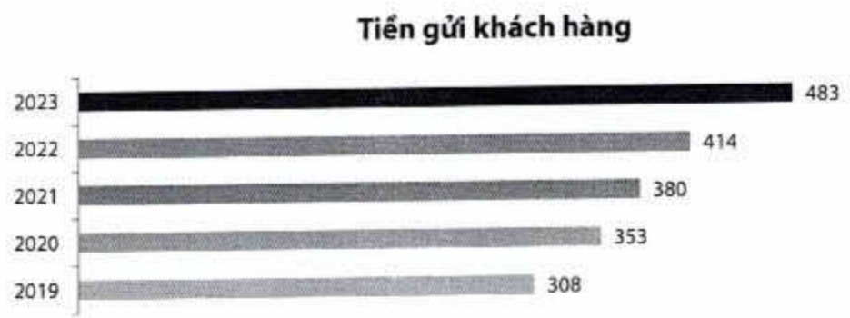
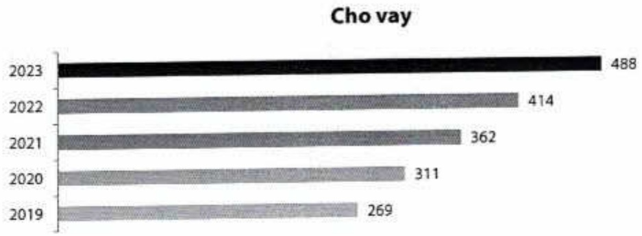

Việt Nam công bố Báo cáo riêng về ESG 2022. ACB đã hai lần liên tiếp được xưởng tên trong Tốp 50 doanh nghiệp phát triển bền vững tiêu biểu Việt Nam (Top 50 Corporate Sustainability Awards).

1.3. Các biểu đồ tăng trưởng (Số liệu hợp nhất của Tập đoàn)

1.3.1. Tổng tài sản (nghin tỷ đồng.)

1.3.2. Tiền gửi khách hàng (nghin tỷ đồng)

1.3.3. Tổng dư nợ cho vay (nghin tỷ đồng)

