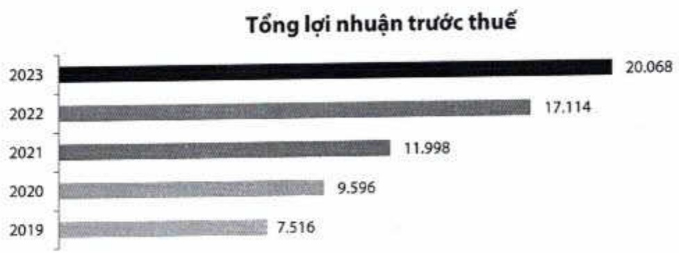

###### 1.3.4. Tổng lợi nhuận trước thuế (tỷ đồng)

1.3.5. Tổng quan tình hình kinh doanh trong năm năm (2019 - 2023)

<table border=1 style='margin: auto; word-wrap: break-word;'><tr><td style='text-align: center; word-wrap: break-word;'>Quy mô (tỷ đồng)</td><td style='text-align: center; word-wrap: break-word;'>2019</td><td style='text-align: center; word-wrap: break-word;'>2020</td><td style='text-align: center; word-wrap: break-word;'>2021</td><td style='text-align: center; word-wrap: break-word;'>2022</td><td style='text-align: center; word-wrap: break-word;'>2023</td></tr><tr><td style='text-align: center; word-wrap: break-word;'>Tổng tài sản</td><td style='text-align: center; word-wrap: break-word;'>383.514</td><td style='text-align: center; word-wrap: break-word;'>444.530</td><td style='text-align: center; word-wrap: break-word;'>527.770</td><td style='text-align: center; word-wrap: break-word;'>607.875</td><td style='text-align: center; word-wrap: break-word;'>718.795</td></tr><tr><td style='text-align: center; word-wrap: break-word;'>Tiền, vàng gửi và cho các TCTD khác vay</td><td style='text-align: center; word-wrap: break-word;'>30.442</td><td style='text-align: center; word-wrap: break-word;'>31.671</td><td style='text-align: center; word-wrap: break-word;'>49.819</td><td style='text-align: center; word-wrap: break-word;'>86.021</td><td style='text-align: center; word-wrap: break-word;'>114.924</td></tr><tr><td style='text-align: center; word-wrap: break-word;'>Cho vay khách hàng</td><td style='text-align: center; word-wrap: break-word;'>268.701</td><td style='text-align: center; word-wrap: break-word;'>311.479</td><td style='text-align: center; word-wrap: break-word;'>361.913</td><td style='text-align: center; word-wrap: break-word;'>413.706</td><td style='text-align: center; word-wrap: break-word;'>487.602</td></tr><tr><td style='text-align: center; word-wrap: break-word;'>Đầu tư tài chính</td><td style='text-align: center; word-wrap: break-word;'>59.672</td><td style='text-align: center; word-wrap: break-word;'>70.229</td><td style='text-align: center; word-wrap: break-word;'>71.107</td><td style='text-align: center; word-wrap: break-word;'>77.159</td><td style='text-align: center; word-wrap: break-word;'>81.090</td></tr><tr><td style='text-align: center; word-wrap: break-word;'>Tiền gửi của khách hàng</td><td style='text-align: center; word-wrap: break-word;'>308.129</td><td style='text-align: center; word-wrap: break-word;'>353.196</td><td style='text-align: center; word-wrap: break-word;'>379.921</td><td style='text-align: center; word-wrap: break-word;'>413.953</td><td style='text-align: center; word-wrap: break-word;'>482.703</td></tr><tr><td style='text-align: center; word-wrap: break-word;'>Tiền gửi và vay TCTD khác</td><td style='text-align: center; word-wrap: break-word;'>19.249</td><td style='text-align: center; word-wrap: break-word;'>23.875</td><td style='text-align: center; word-wrap: break-word;'>54.394</td><td style='text-align: center; word-wrap: break-word;'>67.841</td><td style='text-align: center; word-wrap: break-word;'>89.507</td></tr><tr><td style='text-align: center; word-wrap: break-word;'>Vốn chủ sở hữu</td><td style='text-align: center; word-wrap: break-word;'>27.765</td><td style='text-align: center; word-wrap: break-word;'>35.448</td><td style='text-align: center; word-wrap: break-word;'>44.901</td><td style='text-align: center; word-wrap: break-word;'>58.439</td><td style='text-align: center; word-wrap: break-word;'>70.956</td></tr><tr><td style='text-align: center; word-wrap: break-word;'>Vốn điều lệ</td><td style='text-align: center; word-wrap: break-word;'>16.627</td><td style='text-align: center; word-wrap: break-word;'>21.616</td><td style='text-align: center; word-wrap: break-word;'>27.019</td><td style='text-align: center; word-wrap: break-word;'>33.774</td><td style='text-align: center; word-wrap: break-word;'>38.841</td></tr><tr><td style='text-align: center; word-wrap: break-word;'>Kết quả kinh doanh (tỷ đồng)</td><td style='text-align: center; word-wrap: break-word;'>2019</td><td style='text-align: center; word-wrap: break-word;'>2020</td><td style='text-align: center; word-wrap: break-word;'>2021</td><td style='text-align: center; word-wrap: break-word;'>2022</td><td style='text-align: center; word-wrap: break-word;'>2023</td></tr><tr><td style='text-align: center; word-wrap: break-word;'>Thu nhập lãi thuần</td><td style='text-align: center; word-wrap: break-word;'>12.112</td><td style='text-align: center; word-wrap: break-word;'>14.582</td><td style='text-align: center; word-wrap: break-word;'>18.945</td><td style='text-align: center; word-wrap: break-word;'>23.534</td><td style='text-align: center; word-wrap: break-word;'>24.960</td></tr><tr><td style='text-align: center; word-wrap: break-word;'>Thu nhập ngoài lãi</td><td style='text-align: center; word-wrap: break-word;'>3.985</td><td style='text-align: center; word-wrap: break-word;'>3.579</td><td style='text-align: center; word-wrap: break-word;'>4.619</td><td style='text-align: center; word-wrap: break-word;'>5.257</td><td style='text-align: center; word-wrap: break-word;'>7.787</td></tr><tr><td style='text-align: center; word-wrap: break-word;'>Chi phí hoạt động</td><td style='text-align: center; word-wrap: break-word;'>8.308</td><td style='text-align: center; word-wrap: break-word;'>7.624</td><td style='text-align: center; word-wrap: break-word;'>8.230</td><td style='text-align: center; word-wrap: break-word;'>11.605</td><td style='text-align: center; word-wrap: break-word;'>10.874</td></tr><tr><td style='text-align: center; word-wrap: break-word;'>Chi phí dự phòng</td><td style='text-align: center; word-wrap: break-word;'>274</td><td style='text-align: center; word-wrap: break-word;'>941</td><td style='text-align: center; word-wrap: break-word;'>3.336</td><td style='text-align: center; word-wrap: break-word;'>71</td><td style='text-align: center; word-wrap: break-word;'>1.804</td></tr><tr><td style='text-align: center; word-wrap: break-word;'>Lợi nhuận trước thuế</td><td style='text-align: center; word-wrap: break-word;'>7.516</td><td style='text-align: center; word-wrap: break-word;'>9.596</td><td style='text-align: center; word-wrap: break-word;'>11.998</td><td style='text-align: center; word-wrap: break-word;'>17.114</td><td style='text-align: center; word-wrap: break-word;'>20.068</td></tr><tr><td style='text-align: center; word-wrap: break-word;'>Lợi nhuận sau thuế</td><td style='text-align: center; word-wrap: break-word;'>6.010</td><td style='text-align: center; word-wrap: break-word;'>7.683</td><td style='text-align: center; word-wrap: break-word;'>9.603</td><td style='text-align: center; word-wrap: break-word;'>13.688</td><td style='text-align: center; word-wrap: break-word;'>16.045</td></tr><tr><td style='text-align: center; word-wrap: break-word;'>Hệ sở an toàn vốn (%)</td><td style='text-align: center; word-wrap: break-word;'>2019</td><td style='text-align: center; word-wrap: break-word;'>2020</td><td style='text-align: center; word-wrap: break-word;'>2021</td><td style='text-align: center; word-wrap: break-word;'>2022</td><td style='text-align: center; word-wrap: break-word;'>2023</td></tr><tr><td style='text-align: center; word-wrap: break-word;'>CAR</td><td style='text-align: center; word-wrap: break-word;'>10,9</td><td style='text-align: center; word-wrap: break-word;'>11,1</td><td style='text-align: center; word-wrap: break-word;'>11,2</td><td style='text-align: center; word-wrap: break-word;'>12,8</td><td style='text-align: center; word-wrap: break-word;'>12,5</td></tr><tr><td style='text-align: center; word-wrap: break-word;'>CAR cấp 1</td><td style='text-align: center; word-wrap: break-word;'>9,7</td><td style='text-align: center; word-wrap: break-word;'>10,4</td><td style='text-align: center; word-wrap: break-word;'>11,3</td><td style='text-align: center; word-wrap: break-word;'>12,7</td><td style='text-align: center; word-wrap: break-word;'>12,9</td></tr><tr><td style='text-align: center; word-wrap: break-word;'>Vốn chủ sở hữu/Tổng tài sản</td><td style='text-align: center; word-wrap: break-word;'>7,2</td><td style='text-align: center; word-wrap: break-word;'>8,0</td><td style='text-align: center; word-wrap: break-word;'>8,5</td><td style='text-align: center; word-wrap: break-word;'>9,6</td><td style='text-align: center; word-wrap: break-word;'>9,9</td></tr><tr><td style='text-align: center; word-wrap: break-word;'>Vốn chủ sở hữu/Tổng cho vay khách hàng</td><td style='text-align: center; word-wrap: break-word;'>10,3</td><td style='text-align: center; word-wrap: break-word;'>11,38</td><td style='text-align: center; word-wrap: break-word;'>12,4</td><td style='text-align: center; word-wrap: break-word;'>14,1</td><td style='text-align: center; word-wrap: break-word;'>14,6</td></tr><tr><td style='text-align: center; word-wrap: break-word;'>Khả nàng thanh khoản (%)</td><td style='text-align: center; word-wrap: break-word;'>2019</td><td style='text-align: center; word-wrap: break-word;'>2020</td><td style='text-align: center; word-wrap: break-word;'>2021</td><td style='text-align: center; word-wrap: break-word;'>2022</td><td style='text-align: center; word-wrap: break-word;'>2023</td></tr><tr><td style='text-align: center; word-wrap: break-word;'>Dự nợ cho vay/Tổng tải sản</td><td style='text-align: center; word-wrap: break-word;'>70,1</td><td style='text-align: center; word-wrap: break-word;'>70,1</td><td style='text-align: center; word-wrap: break-word;'>68,6</td><td style='text-align: center; word-wrap: break-word;'>68,1</td><td style='text-align: center; word-wrap: break-word;'>67,8</td></tr><tr><td style='text-align: center; word-wrap: break-word;'>Tổng dư nợ cho vay/Tổng tiền gửi khách hàng theo NHNN</td><td style='text-align: center; word-wrap: break-word;'>77,6</td><td style='text-align: center; word-wrap: break-word;'>79,3</td><td style='text-align: center; word-wrap: break-word;'>79,0</td><td style='text-align: center; word-wrap: break-word;'>78,4</td><td style='text-align: center; word-wrap: break-word;'>78,1</td></tr><tr><td style='text-align: center; word-wrap: break-word;'>Chất lượng tài sản</td><td style='text-align: center; word-wrap: break-word;'>2019</td><td style='text-align: center; word-wrap: break-word;'>2020</td><td style='text-align: center; word-wrap: break-word;'>2021</td><td style='text-align: center; word-wrap: break-word;'>2022</td><td style='text-align: center; word-wrap: break-word;'>2023</td></tr><tr><td style='text-align: center; word-wrap: break-word;'>Nợ xấu (tỷ đồng)</td><td style='text-align: center; word-wrap: break-word;'>1.449</td><td style='text-align: center; word-wrap: break-word;'>1.840</td><td style='text-align: center; word-wrap: break-word;'>2.799</td><td style='text-align: center; word-wrap: break-word;'>3.045</td><td style='text-align: center; word-wrap: break-word;'>5.887</td></tr><tr><td style='text-align: center; word-wrap: break-word;'>Nợ quá hạn (tỷ đồng)</td><td style='text-align: center; word-wrap: break-word;'>2.080</td><td style='text-align: center; word-wrap: break-word;'>2.416</td><td style='text-align: center; word-wrap: break-word;'>4.697</td><td style='text-align: center; word-wrap: break-word;'>5.388</td><td style='text-align: center; word-wrap: break-word;'>9.062</td></tr><tr><td style='text-align: center; word-wrap: break-word;'>Tỷ lệ nợ xấu (%)</td><td style='text-align: center; word-wrap: break-word;'>0,5</td><td style='text-align: center; word-wrap: break-word;'>0,6</td><td style='text-align: center; word-wrap: break-word;'>0,8</td><td style='text-align: center; word-wrap: break-word;'>0,7</td><td style='text-align: center; word-wrap: break-word;'>1,2</td></tr><tr><td style='text-align: center; word-wrap: break-word;'>Nhóm 5/Tổng nợ xấu (%)</td><td style='text-align: center; word-wrap: break-word;'>62,3</td><td style='text-align: center; word-wrap: break-word;'>66,1</td><td style='text-align: center; word-wrap: break-word;'>49,3</td><td style='text-align: center; word-wrap: break-word;'>71,1</td><td style='text-align: center; word-wrap: break-word;'>66,2</td></tr><tr><td style='text-align: center; word-wrap: break-word;'>Tỷ lệ nợ quá hạn (%)</td><td style='text-align: center; word-wrap: break-word;'>0,8</td><td style='text-align: center; word-wrap: break-word;'>0,8</td><td style='text-align: center; word-wrap: break-word;'>1,3</td><td style='text-align: center; word-wrap: break-word;'>1,3</td><td style='text-align: center; word-wrap: break-word;'>1,9</td></tr><tr><td style='text-align: center; word-wrap: break-word;'>Quỹ dự phòng rủi ro/Tổng nợ xấu (%)</td><td style='text-align: center; word-wrap: break-word;'>175,0</td><td style='text-align: center; word-wrap: break-word;'>160,3</td><td style='text-align: center; word-wrap: break-word;'>209,4</td><td style='text-align: center; word-wrap: break-word;'>159,3</td><td style='text-align: center; word-wrap: break-word;'>91,2</td></tr><tr><td style='text-align: center; word-wrap: break-word;'>(Vốn chủ sở hữu + Dự phòng) Tổng nợ xấu (số lần)</td><td style='text-align: center; word-wrap: break-word;'>19</td><td style='text-align: center; word-wrap: break-word;'>19</td><td style='text-align: center; word-wrap: break-word;'>18</td><td style='text-align: center; word-wrap: break-word;'>21</td><td style='text-align: center; word-wrap: break-word;'>13</td></tr><tr><td style='text-align: center; word-wrap: break-word;'>CASA (%)</td><td style='text-align: center; word-wrap: break-word;'>19,1</td><td style='text-align: center; word-wrap: break-word;'>21,6</td><td style='text-align: center; word-wrap: break-word;'>25,5</td><td style='text-align: center; word-wrap: break-word;'>22,3</td><td style='text-align: center; word-wrap: break-word;'>22,0</td></tr><tr><td style='text-align: center; word-wrap: break-word;'>Khả năng sinh lời (%)</td><td style='text-align: center; word-wrap: break-word;'>2019</td><td style='text-align: center; word-wrap: break-word;'>2020</td><td style='text-align: center; word-wrap: break-word;'>2021</td><td style='text-align: center; word-wrap: break-word;'>2022</td><td style='text-align: center; word-wrap: break-word;'>2023</td></tr><tr><td style='text-align: center; word-wrap: break-word;'>ROE</td><td style='text-align: center; word-wrap: break-word;'>24,6</td><td style='text-align: center; word-wrap: break-word;'>24,3</td><td style='text-align: center; word-wrap: break-word;'>23,9</td><td style='text-align: center; word-wrap: break-word;'>26,5</td><td style='text-align: center; word-wrap: break-word;'>24,8</td></tr><tr><td style='text-align: center; word-wrap: break-word;'>ROA</td><td style='text-align: center; word-wrap: break-word;'>1,7</td><td style='text-align: center; word-wrap: break-word;'>1,9</td><td style='text-align: center; word-wrap: break-word;'>2,0</td><td style='text-align: center; word-wrap: break-word;'>2,4</td><td style='text-align: center; word-wrap: break-word;'>2,4</td></tr><tr><td style='text-align: center; word-wrap: break-word;'>NIM</td><td style='text-align: center; word-wrap: break-word;'>3,4</td><td style='text-align: center; word-wrap: break-word;'>3,5</td><td style='text-align: center; word-wrap: break-word;'>3,9</td><td style='text-align: center; word-wrap: break-word;'>4,1</td><td style='text-align: center; word-wrap: break-word;'>3,8</td></tr><tr><td style='text-align: center; word-wrap: break-word;'>Thu nhập ngoài lãi/Tổng thu nhập</td><td style='text-align: center; word-wrap: break-word;'>24,8</td><td style='text-align: center; word-wrap: break-word;'>19,7</td><td style='text-align: center; word-wrap: break-word;'>19,6</td><td style='text-align: center; word-wrap: break-word;'>18,3</td><td style='text-align: center; word-wrap: break-word;'>23,8</td></tr><tr><td style='text-align: center; word-wrap: break-word;'>Chi phí hoạt động/Tổng thu nhập</td><td style='text-align: center; word-wrap: break-word;'>51,6</td><td style='text-align: center; word-wrap: break-word;'>42,0</td><td style='text-align: center; word-wrap: break-word;'>34,9</td><td style='text-align: center; word-wrap: break-word;'>40,3</td><td style='text-align: center; word-wrap: break-word;'>33,2</td></tr><tr><td style='text-align: center; word-wrap: break-word;'>Chi phí dự phòng/Lợi nhuận trước dự phòng</td><td style='text-align: center; word-wrap: break-word;'>3,5</td><td style='text-align: center; word-wrap: break-word;'>8,9</td><td style='text-align: center; word-wrap: break-word;'>21,8</td><td style='text-align: center; word-wrap: break-word;'>0,4</td><td style='text-align: center; word-wrap: break-word;'>8,2</td></tr></table>