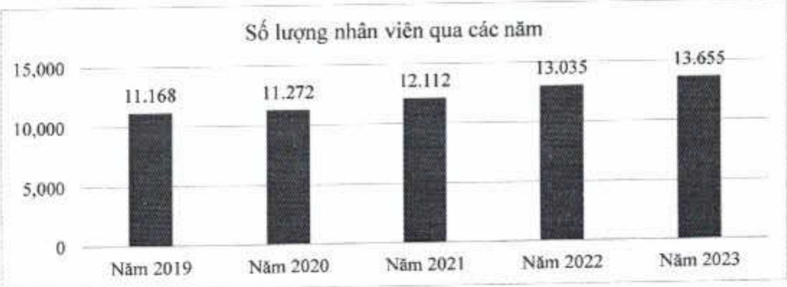

### Ông Nguyễn Khắc Nguyện, Phó Tổng giám đốc

Vào ACB năm 2006.

Trải qua các vị trí sau: Giám đốc Truyền thông nội bộ, Giám đốc Quản trị truyền thông và thương hiệu, Phó Giám đốc Khối Quản trị nguồn nhân lực, Giám đốc Trung tâm học tập, và Giám đốc Khối Quản trị nguồn nhân lực.

Được bổ nhiệm Phó Tổng giám đốc năm 2022.

Tốt nghiệp cứ nhân tài chính, tiền tệ, ngân hàng của Trường Đại học Kinh tế TP. Hồ Chí Minh, và thực sự kinh doanh quốc tế của Trường Đại học Curtin, Úc.

### Ông Ngô Tấn Long, Phó Tông giám đốc

Vào ACB năm 2008.

Trái qua các vị trí sau: Trường phòng Phòng Phân tích tín dụng, Phó Giám độc Khối khách hàng doanh nghiệp kiểm Giám độc Trung tâm phê duyệt tín dụng doanh nghiệp, Giám độc chi nhánh, Giám độc Vùng, và Giám độc Khối Khách hàng doanh nghiệp.

Được bổ nhiệm Phó Tổng giám đốc năm 2023.

Tốt nghiệp cứ nhân quản trị kinh doanh và thực sự kinh tế của Trường Đại học Kinh tế TP. Hồ Chí Minh.

##### 2.2. Những thay đổi trong BĐH

Ông Ngô Tấn Long được bỏ nhiệm Phó Tổng giảm độc ngày 12/01/2023.

2.3. Số lượng cán bộ nhân viên, tóm tắt chính sách và thay đổi trong chính sách đối với người lao động

2.3.1. Số lượng cán bộ nhân viên 2019 - 2023 (theo BCTC hợp nhất)

Tính đến ngày 31/12/2023, ACB có 13.655 nhân viên.

2023)

Thu nhập bình quân của nhân viên trong năm 2023 là 441 triệu đồng.