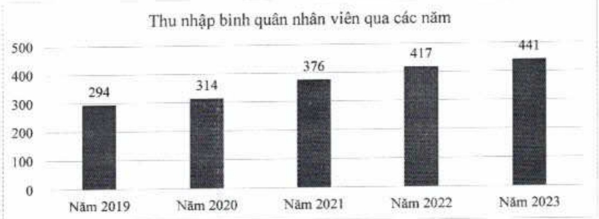

#### 2.3.2. Tóm tắt chính sách và thay đổi trong chính sách đối với người lao động

(Xin xem Mục 6.6. "Chính sách liên quan đến người lao động" của chương II này.)

Tình hình đấu tư, tình hình thực hiện các dự án

##### 3.1. Các khoản đầu tư lớn

Trong năm 2023, ACB không thực hiện đầu tư tài chính. Các khoản đầu tư cho các dự án chiến lược năm trong kế hoạch thu nhập chi phí hàng năm.

##### 3.2. Các công ty con, công ty liên kết

Tập đoàn ACB có bốn công ty con.

<table border=1 style='margin: auto; word-wrap: break-word;'><tr><td style='text-align: center; word-wrap: break-word;'>Tên công ty</td><td style='text-align: center; word-wrap: break-word;'>Địa chỉ</td><td style='text-align: center; word-wrap: break-word;'>Giấy phép hoạt động/Lĩnh vực kinh doanh chính</td><td style='text-align: center; word-wrap: break-word;'>Vốn điều lệ thực góp (tỷ đồng)</td><td style='text-align: center; word-wrap: break-word;'>% đầu tư trực tiếp bởi ACB</td><td style='text-align: center; word-wrap: break-word;'>% đầu tư giản tiếp bởi công ty con</td><td style='text-align: center; word-wrap: break-word;'>Tổng % đầu tư</td></tr><tr><td style='text-align: center; word-wrap: break-word;'>ACBS</td><td style='text-align: center; word-wrap: break-word;'>Tầng 3, Tòa nhà Léman Luxury, 117 Nguyễn Đình Chiều, Phương Vũ Thị Sáu, Quận 3, TP. HCM.</td><td style='text-align: center; word-wrap: break-word;'>06/GPHDKD Chứng khoán</td><td style='text-align: center; word-wrap: break-word;'>4.000</td><td style='text-align: center; word-wrap: break-word;'>100</td><td style='text-align: center; word-wrap: break-word;'>-</td><td style='text-align: center; word-wrap: break-word;'>100</td></tr><tr><td style='text-align: center; word-wrap: break-word;'>ACBA</td><td style='text-align: center; word-wrap: break-word;'>Lầu 8 Tòa nhà ACB, 444A - 446 Cách Mạng Tháng Tám, Quận 3, TP. HCM.</td><td style='text-align: center; word-wrap: break-word;'>0303539425 Quân lý nợ và khai thác tài sản</td><td style='text-align: center; word-wrap: break-word;'>5</td><td style='text-align: center; word-wrap: break-word;'>100</td><td style='text-align: center; word-wrap: break-word;'>-</td><td style='text-align: center; word-wrap: break-word;'>100</td></tr><tr><td style='text-align: center; word-wrap: break-word;'>ACBL</td><td style='text-align: center; word-wrap: break-word;'>Lầu 9, Tòa nhà ACB, 444A - 446 Cách Mạng Tháng</td><td style='text-align: center; word-wrap: break-word;'>06/GP-NHNN Cho thuê tài chính</td><td style='text-align: center; word-wrap: break-word;'>500</td><td style='text-align: center; word-wrap: break-word;'>100</td><td style='text-align: center; word-wrap: break-word;'>-</td><td style='text-align: center; word-wrap: break-word;'>100</td></tr><tr><td style='text-align: center; word-wrap: break-word;'></td><td style='text-align: center; word-wrap: break-word;'>Tám, Quận 3, TP. HCM.</td><td style='text-align: center; word-wrap: break-word;'></td><td style='text-align: center; word-wrap: break-word;'></td><td style='text-align: center; word-wrap: break-word;'></td><td style='text-align: center; word-wrap: break-word;'></td><td style='text-align: center; word-wrap: break-word;'></td></tr><tr><td style='text-align: center; word-wrap: break-word;'>ACBC</td><td style='text-align: center; word-wrap: break-word;'>Lầu 12 Tòa nhà ACB, 480 Nguyễn Thị Minh Khai, Quận 3, TP. HCM.</td><td style='text-align: center; word-wrap: break-word;'>41/UBCK-GP Quân lý quỹ</td><td style='text-align: center; word-wrap: break-word;'>50</td><td style='text-align: center; word-wrap: break-word;'>-</td><td style='text-align: center; word-wrap: break-word;'>100</td><td style='text-align: center; word-wrap: break-word;'>100</td></tr></table>