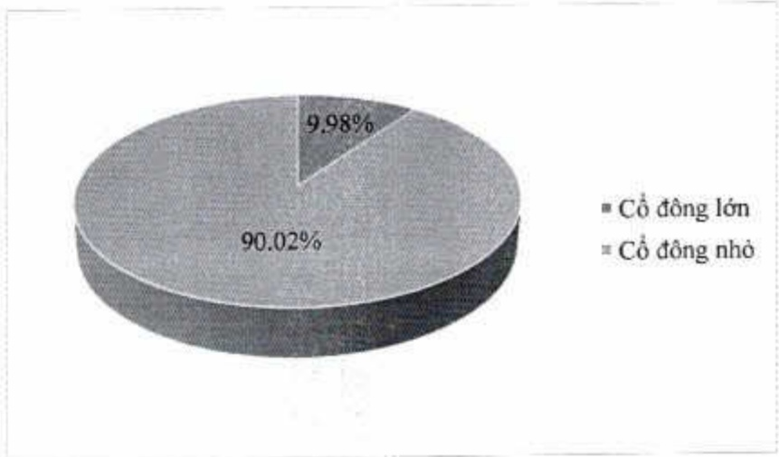

Số lượng cổ phần tự do chuyển nhượng: 3.694.569.892 cổ phần

Số lượng cổ phần hạn chế chuyển nhượng: 189.480.466 cổ phần

5.2. Cơ cấu cổ động

5.2.1. Theo tiêu chí tỷ lệ sở hữu (cỗ động lớn [*], cỗ động nhỏ)

<table border=1 style='margin: auto; word-wrap: break-word;'><tr><td style='text-align: center; word-wrap: break-word;'></td><td style='text-align: center; word-wrap: break-word;'>Số lượng cổ đông</td><td style='text-align: center; word-wrap: break-word;'>Số lượng cổ phần</td><td style='text-align: center; word-wrap: break-word;'>Tỷ lệ sở hữu cổ phần</td></tr><tr><td style='text-align: center; word-wrap: break-word;'>Cổ đông lớn</td><td style='text-align: center; word-wrap: break-word;'>2</td><td style='text-align: center; word-wrap: break-word;'>387.814.372</td><td style='text-align: center; word-wrap: break-word;'>9,98%</td></tr><tr><td style='text-align: center; word-wrap: break-word;'>Cổ đông nhỏ</td><td style='text-align: center; word-wrap: break-word;'>60.032</td><td style='text-align: center; word-wrap: break-word;'>3.496.235.986</td><td style='text-align: center; word-wrap: break-word;'>90,02%</td></tr><tr><td style='text-align: center; word-wrap: break-word;'>Tổng cộng</td><td style='text-align: center; word-wrap: break-word;'>60.034</td><td style='text-align: center; word-wrap: break-word;'>3.884.050.358</td><td style='text-align: center; word-wrap: break-word;'>100,00%</td></tr></table>

[*] Theo khoản 26 Điều 4 của Luật Các TCTD năm 2010 thì "cổ đông lớn của tổ chức tín dụng cổ phần là cổ đông sở hữu trực tiếp, gián tiếp từ 5% vốn cổ phần có quyền biểu quyết trò lên của tổ chức tín dụng cổ phần đó."

5.2.2. Theo tiêu chí cổ động tỗ chức và cổ động cá nhân

<table border=1 style='margin: auto; word-wrap: break-word;'><tr><td style='text-align: center; word-wrap: break-word;'></td><td style='text-align: center; word-wrap: break-word;'>Số lượng cổ đông</td><td style='text-align: center; word-wrap: break-word;'>Số lượng cổ phần</td><td style='text-align: center; word-wrap: break-word;'>Tỷ lệ sở hữu cổ phần</td></tr><tr><td style='text-align: center; word-wrap: break-word;'>Tổ chức</td><td style='text-align: center; word-wrap: break-word;'>410</td><td style='text-align: center; word-wrap: break-word;'>2.047.145.559</td><td style='text-align: center; word-wrap: break-word;'>52,71%</td></tr><tr><td style='text-align: center; word-wrap: break-word;'>Cả nhân</td><td style='text-align: center; word-wrap: break-word;'>59.624</td><td style='text-align: center; word-wrap: break-word;'>1.836.904.799</td><td style='text-align: center; word-wrap: break-word;'>47,29%</td></tr><tr><td style='text-align: center; word-wrap: break-word;'>Tổng cộng</td><td style='text-align: center; word-wrap: break-word;'>60.034</td><td style='text-align: center; word-wrap: break-word;'>3.884.050.358</td><td style='text-align: center; word-wrap: break-word;'>100,00%</td></tr></table>