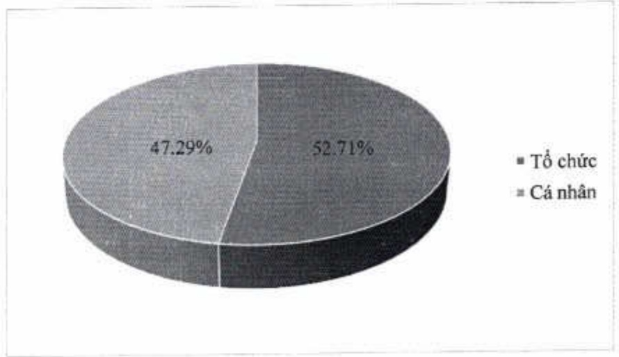
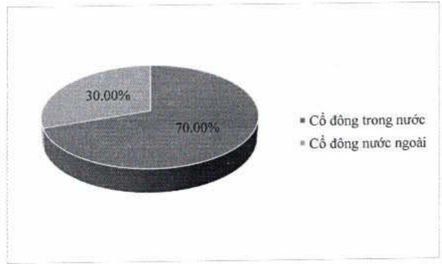

5.2.3. Theo tiêu chí cổ động trong nước và cổ động nước ngoài

<table border=1 style='margin: auto; word-wrap: break-word;'><tr><td style='text-align: center; word-wrap: break-word;'></td><td style='text-align: center; word-wrap: break-word;'>Số lượng cổ đông</td><td style='text-align: center; word-wrap: break-word;'>Số lượng cổ phần</td><td style='text-align: center; word-wrap: break-word;'>Tỷ lệ sở hữu cổ phần</td></tr><tr><td style='text-align: center; word-wrap: break-word;'>Cổ đông trong nước</td><td style='text-align: center; word-wrap: break-word;'>59.882</td><td style='text-align: center; word-wrap: break-word;'>2.718.839.251</td><td style='text-align: center; word-wrap: break-word;'>70,00%</td></tr><tr><td style='text-align: center; word-wrap: break-word;'>Cổ đông nước ngoài</td><td style='text-align: center; word-wrap: break-word;'>152</td><td style='text-align: center; word-wrap: break-word;'>1.165.211.107</td><td style='text-align: center; word-wrap: break-word;'>30,00%</td></tr><tr><td style='text-align: center; word-wrap: break-word;'>Tổng cộng</td><td style='text-align: center; word-wrap: break-word;'>60.034</td><td style='text-align: center; word-wrap: break-word;'>3.884.050.358</td><td style='text-align: center; word-wrap: break-word;'>100,00%</td></tr></table>

5.2.4. Theo tiêu chí cổ động trong nước và cổ động nước ngoài, cổ động tổ chức và cổ động cá nhân