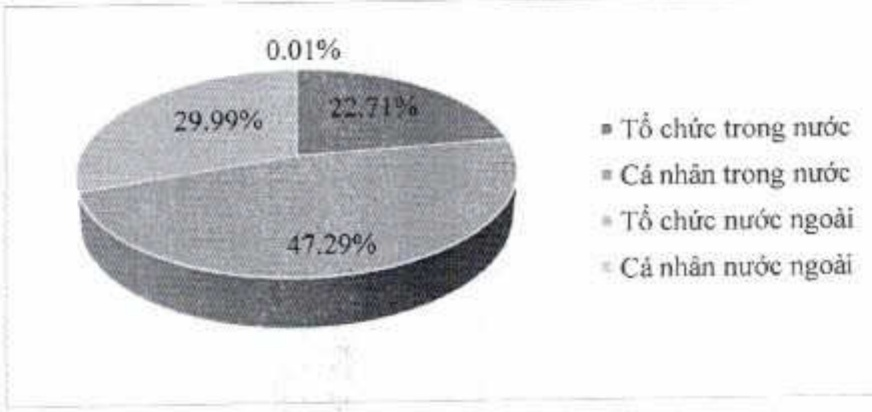

<table border=1 style='margin: auto; word-wrap: break-word;'><tr><td style='text-align: center; word-wrap: break-word;'></td><td style='text-align: center; word-wrap: break-word;'>Số lượng cổ đông</td><td style='text-align: center; word-wrap: break-word;'>Số lượng cổ phần</td><td style='text-align: center; word-wrap: break-word;'>Tỷ lệ số hữu cổ phần</td></tr><tr><td style='text-align: center; word-wrap: break-word;'>Cổ đông trong nước (1)</td><td style='text-align: center; word-wrap: break-word;'>59.882</td><td style='text-align: center; word-wrap: break-word;'>2.718.839.251</td><td style='text-align: center; word-wrap: break-word;'>70,00%</td></tr><tr><td style='text-align: center; word-wrap: break-word;'>- Tổ chức</td><td style='text-align: center; word-wrap: break-word;'>296</td><td style='text-align: center; word-wrap: break-word;'>882.168.182</td><td style='text-align: center; word-wrap: break-word;'>22,71%</td></tr><tr><td style='text-align: center; word-wrap: break-word;'>- Cá nhân</td><td style='text-align: center; word-wrap: break-word;'>59.586</td><td style='text-align: center; word-wrap: break-word;'>1.836.671.069</td><td style='text-align: center; word-wrap: break-word;'>47,29%</td></tr><tr><td style='text-align: center; word-wrap: break-word;'>Cổ đông nước ngoài (2)</td><td style='text-align: center; word-wrap: break-word;'>152</td><td style='text-align: center; word-wrap: break-word;'>1.165.211.107</td><td style='text-align: center; word-wrap: break-word;'>30,00%</td></tr><tr><td style='text-align: center; word-wrap: break-word;'>- Tổ chức</td><td style='text-align: center; word-wrap: break-word;'>114</td><td style='text-align: center; word-wrap: break-word;'>1.164.977.377</td><td style='text-align: center; word-wrap: break-word;'>29,99%</td></tr><tr><td style='text-align: center; word-wrap: break-word;'>- Cá nhân</td><td style='text-align: center; word-wrap: break-word;'>38</td><td style='text-align: center; word-wrap: break-word;'>233.730</td><td style='text-align: center; word-wrap: break-word;'>0,01%</td></tr><tr><td style='text-align: center; word-wrap: break-word;'>Cộng (1) &amp; (2)</td><td style='text-align: center; word-wrap: break-word;'>60.034</td><td style='text-align: center; word-wrap: break-word;'>3.884.050.358</td><td style='text-align: center; word-wrap: break-word;'>100,00%</td></tr></table>

###### 5.2.5. Cổ đông lớn nước ngoài

Tỷ lệ sở hữu nước ngoài tối đa tại ACB là 30%.

Cổ đông lớn nước ngoài sở hữu trực tiếp hoặc gián tiếp từ 5% vốn cổ phần có quyền biểu quyết trở lên, gồm có:

<table border=1 style='margin: auto; word-wrap: break-word;'><tr><td style='text-align: center; word-wrap: break-word;'>STT</td><td style='text-align: center; word-wrap: break-word;'>Tên</td><td style='text-align: center; word-wrap: break-word;'>Địa chỉ</td><td style='text-align: center; word-wrap: break-word;'>Ngành nghề</td><td style='text-align: center; word-wrap: break-word;'>Số lượng cổ phần</td></tr><tr><td style='text-align: center; word-wrap: break-word;'></td><td colspan="4">Alp Asia Finance (Vietnam) Limited là tổ chức sở hữu cổ phần gián tiếp thông qua hai công ty con là cổ động của ACB sau đây:</td></tr><tr><td style='text-align: center; word-wrap: break-word;'>1</td><td style='text-align: center; word-wrap: break-word;'>Sather Gate Investments Limited</td><td style='text-align: center; word-wrap: break-word;'>Kingston Chambers, PO Box 173, Road Town, Tortola, British Virgin Islands</td><td style='text-align: center; word-wrap: break-word;'>Đầu tư</td><td style='text-align: center; word-wrap: break-word;'>193.907.186 (4,99%)</td></tr><tr><td style='text-align: center; word-wrap: break-word;'>2</td><td style='text-align: center; word-wrap: break-word;'>Whistler Investments Limited</td><td style='text-align: center; word-wrap: break-word;'>Kingston Chambers, PO Box 173, Road Town, Tortola, British Virgin Islands</td><td style='text-align: center; word-wrap: break-word;'>Đầu tư</td><td style='text-align: center; word-wrap: break-word;'>193.907.186 (4,99%)</td></tr></table>

5.3. Tình hình thay đổi vốn đầu tư của chủ sở hữu

Sự thay đổi về vốn cô động như sau trong ba năm qua như sau: