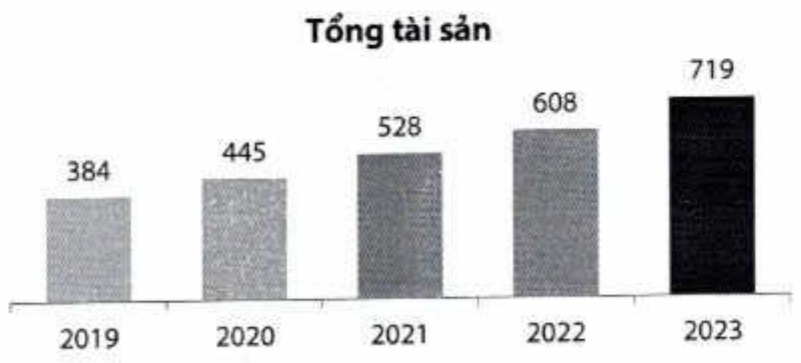
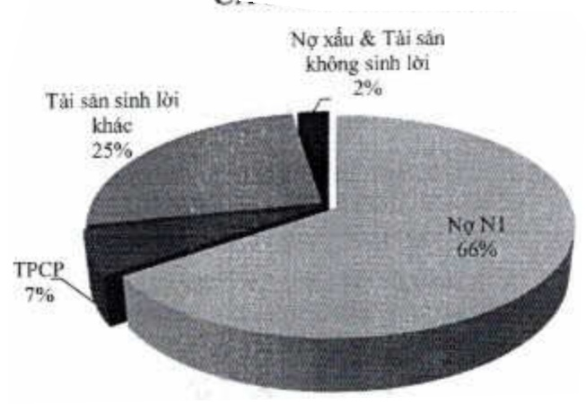

Tài sản sinh lời trong cơ cấu tài sản tiếp tục tăng, đạt đến 97% tổng tài sản; riêng ngữ nhóm 1 chiếm đến khoảng 66%, đảm bảo hiệu quả sử dụng vốn.

CÁU TRỨC TÀI SẢN

#### 2.1.2. Vốn

Đến cuối năm 2023, tỷ lệ an toàn vốn hợp nhất ở mức 12,48%, cao hơn mức quy định tối thiểu 8%. Tổng vốn tự có đạt hơn 68 nghìn tỷ đồng, tăng 16% so với năm 2022.

<table border=1 style='margin: auto; word-wrap: break-word;'><tr><td style='text-align: center; word-wrap: break-word;'>Chi tiêu</td><td style='text-align: center; word-wrap: break-word;'>2019</td><td style='text-align: center; word-wrap: break-word;'>2020</td><td style='text-align: center; word-wrap: break-word;'>2021</td><td style='text-align: center; word-wrap: break-word;'>2022</td><td style='text-align: center; word-wrap: break-word;'>2023</td></tr><tr><td style='text-align: center; word-wrap: break-word;'>An toàn vốn (%)</td><td style='text-align: center; word-wrap: break-word;'>10,91</td><td style='text-align: center; word-wrap: break-word;'>11,06</td><td style='text-align: center; word-wrap: break-word;'>11,23</td><td style='text-align: center; word-wrap: break-word;'>12,80</td><td style='text-align: center; word-wrap: break-word;'>12,48</td></tr><tr><td style='text-align: center; word-wrap: break-word;'>An toàn vốn cấp 1 (%)</td><td style='text-align: center; word-wrap: break-word;'>9,66</td><td style='text-align: center; word-wrap: break-word;'>10,37</td><td style='text-align: center; word-wrap: break-word;'>11,26</td><td style='text-align: center; word-wrap: break-word;'>12,69</td><td style='text-align: center; word-wrap: break-word;'>12,94</td></tr><tr><td style='text-align: center; word-wrap: break-word;'>Tổng tài sản có rủi ro (tỷ đồng)</td><td style='text-align: center; word-wrap: break-word;'>283.931</td><td style='text-align: center; word-wrap: break-word;'>338.337</td><td style='text-align: center; word-wrap: break-word;'>395.018</td><td style='text-align: center; word-wrap: break-word;'>457.049</td><td style='text-align: center; word-wrap: break-word;'>545.026</td></tr><tr><td style='text-align: center; word-wrap: break-word;'>Vốn tự có (tỷ đồng)</td><td style='text-align: center; word-wrap: break-word;'>30.977</td><td style='text-align: center; word-wrap: break-word;'>37.414</td><td style='text-align: center; word-wrap: break-word;'>44.374</td><td style='text-align: center; word-wrap: break-word;'>58.519</td><td style='text-align: center; word-wrap: break-word;'>68.029</td></tr></table>