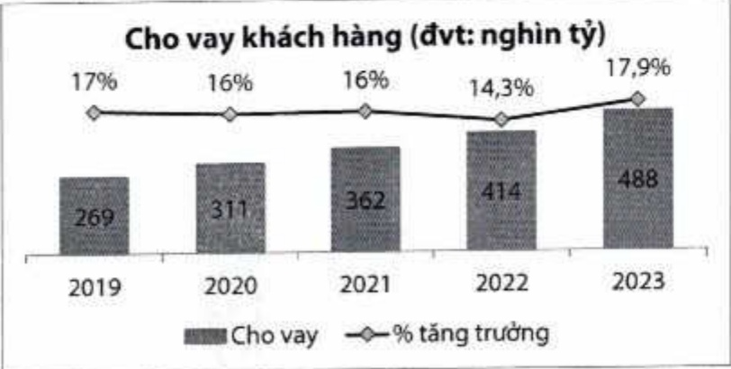
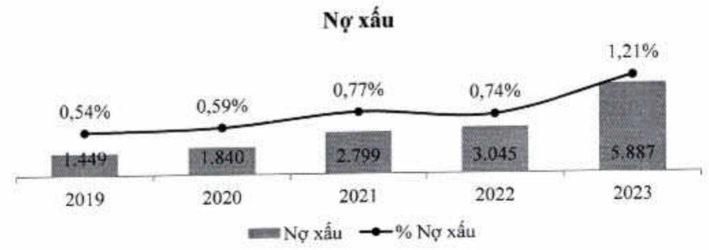

###### 2.1.5. Chất lượng tín dụng

- ACB chủ động và nghiêm túc trong việc kiểm soát và xử lý nợ xấu. Trong bối cảnh tỷ lệ nợ xấu toàn ngành nói chung và tại ACB nói riêng có xu hướng tăng trên 1%, ở mức 1,2%, ACB vẫn có tỷ lệ nợ xấu ở mức thấp hàng đầu thị trường.

<table border=1 style='margin: auto; word-wrap: break-word;'><tr><td style='text-align: center; word-wrap: break-word;'></td><td style='text-align: center; word-wrap: break-word;'>2019</td><td style='text-align: center; word-wrap: break-word;'>2020</td><td style='text-align: center; word-wrap: break-word;'>2021</td><td style='text-align: center; word-wrap: break-word;'>2022</td><td style='text-align: center; word-wrap: break-word;'>2023</td></tr><tr><td style='text-align: center; word-wrap: break-word;'>Nợ nhóm 3-5 (tỷ đồng)</td><td style='text-align: center; word-wrap: break-word;'>1.449</td><td style='text-align: center; word-wrap: break-word;'>1.840</td><td style='text-align: center; word-wrap: break-word;'>2.799</td><td style='text-align: center; word-wrap: break-word;'>3.045</td><td style='text-align: center; word-wrap: break-word;'>5.887</td></tr><tr><td style='text-align: center; word-wrap: break-word;'>Tỷ lệ nợ nhóm 3-5/Tổng dư nợ cho vay (%)</td><td style='text-align: center; word-wrap: break-word;'>0,54</td><td style='text-align: center; word-wrap: break-word;'>0,59</td><td style='text-align: center; word-wrap: break-word;'>0,77</td><td style='text-align: center; word-wrap: break-word;'>0,74</td><td style='text-align: center; word-wrap: break-word;'>1,21</td></tr><tr><td style='text-align: center; word-wrap: break-word;'>Dự phòng/Tổng nợ xấu (%)</td><td style='text-align: center; word-wrap: break-word;'>175</td><td style='text-align: center; word-wrap: break-word;'>160</td><td style='text-align: center; word-wrap: break-word;'>209</td><td style='text-align: center; word-wrap: break-word;'>159</td><td style='text-align: center; word-wrap: break-word;'>91</td></tr></table>

#### 2.1.6. Hoạt động huy động vốn

Hoạt động nhận tiền gửi cũng ghi nhận mức tăng trưởng cao nhất trong vòng 5 năm trở lại đây, ở mức 17%, đạt 483 nghìn tỷ đồng, góp phần cải thiện thị phần tiền gửi khách hàng.