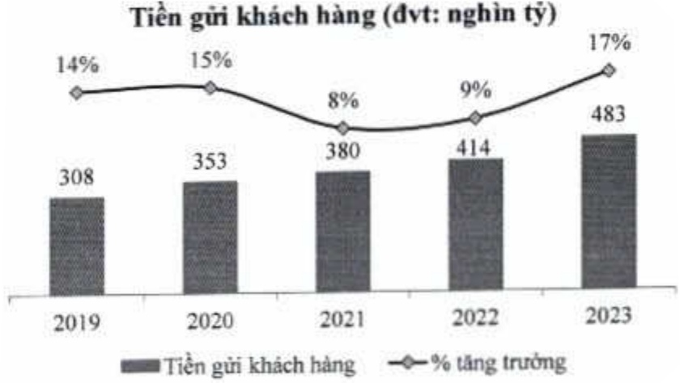
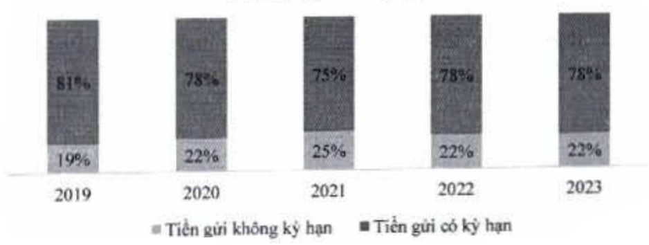

Tiền gửi khách hàng (đv: nghìn tỷ)

- ACB có ưu thế về ngân hàng bán lẻ; tỷ trọng tiền gửi từ khách hàng cá nhân lên đến gần 80% tổng tiền gửi. Trong năm 2023, tỷ trọng tiền gửi không ký hạn trên tổng tiền gửi tương đương so với năm 2022, duy trì ở mức 22%, đứng vị trí thứ 6 trên thị trường.

Huy động theo kỳ hạn

#### 2.1.7. Vốn chủ sở hữu

Vốn chủ sở hữu tăng 21% so với năm 2022 và đạt 71 nghìn tỷ đồng. Trong năm, ACB chỉ trả cỗ tức cho cổ đồng bằng tiền mặt với tỷ lệ 10% và cổ tức bằng cổ phiếu với tỷ lệ 15%, do đó vốn điều lệ tăng tương ứng 15% so với năm 2022.

ĐVT: Tỷ đồng

<table border=1 style='margin: auto; word-wrap: break-word;'><tr><td style='text-align: center; word-wrap: break-word;'>Chỉ tiêu</td><td style='text-align: center; word-wrap: break-word;'>2023</td><td style='text-align: center; word-wrap: break-word;'>2022</td><td style='text-align: center; word-wrap: break-word;'>% tăng giảm</td></tr><tr><td style='text-align: center; word-wrap: break-word;'>Vốn điều lệ</td><td style='text-align: center; word-wrap: break-word;'>38.841</td><td style='text-align: center; word-wrap: break-word;'>33.774</td><td style='text-align: center; word-wrap: break-word;'>15</td></tr><tr><td style='text-align: center; word-wrap: break-word;'>Thăng dư vốn cổ phần</td><td style='text-align: center; word-wrap: break-word;'>272</td><td style='text-align: center; word-wrap: break-word;'>272</td><td style='text-align: center; word-wrap: break-word;'>0</td></tr><tr><td style='text-align: center; word-wrap: break-word;'>Cổ phiếu quỹ</td><td style='text-align: center; word-wrap: break-word;'>-</td><td style='text-align: center; word-wrap: break-word;'>-</td><td style='text-align: center; word-wrap: break-word;'>0</td></tr><tr><td style='text-align: center; word-wrap: break-word;'>Quỹ của TCTD</td><td style='text-align: center; word-wrap: break-word;'>11.557</td><td style='text-align: center; word-wrap: break-word;'>9.220</td><td style='text-align: center; word-wrap: break-word;'>25</td></tr><tr><td style='text-align: center; word-wrap: break-word;'>Chênh lệch tỷ giá</td><td style='text-align: center; word-wrap: break-word;'>-</td><td style='text-align: center; word-wrap: break-word;'>-</td><td style='text-align: center; word-wrap: break-word;'>0</td></tr><tr><td style='text-align: center; word-wrap: break-word;'>Lợi nhuận chưa phân phối</td><td style='text-align: center; word-wrap: break-word;'>20.286</td><td style='text-align: center; word-wrap: break-word;'>15.172</td><td style='text-align: center; word-wrap: break-word;'>34</td></tr><tr><td style='text-align: center; word-wrap: break-word;'>Tổng vốn chủ sở hữu</td><td style='text-align: center; word-wrap: break-word;'>70.956</td><td style='text-align: center; word-wrap: break-word;'>58.439</td><td style='text-align: center; word-wrap: break-word;'>21</td></tr></table>