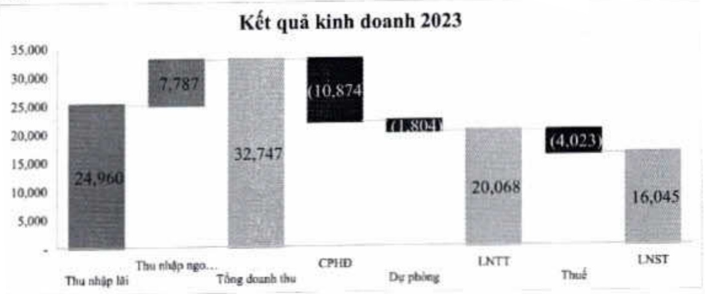

##### 2.2. Phân tích kết quả kinh doanh

###### 2.2.1. Thu nhập

Lợi nhuận trước thuế toàn Tập đoàn là 20.068 tỷ đồng, tăng 17% so với năm 2022 và hoàn thành 100% kế hoạch.

Tổng thu nhập trong năm của ACB đạt 32.747 tỷ đồng, tăng 14% so với cùng kỳ, chủ yếu nhờ vào thu nhập ngoài lãi tăng 48%. NIM có sự sụt giam so với năm 2022, còn 3,76%, do mặt bằng lãi suất cho vay giám nhanh hơn lãi suất huy động và ACB thực hiện giám lãi suất cho vay để hỗ trợ khách hàng trong bối cảnh kinh tế khó khăn.

242

