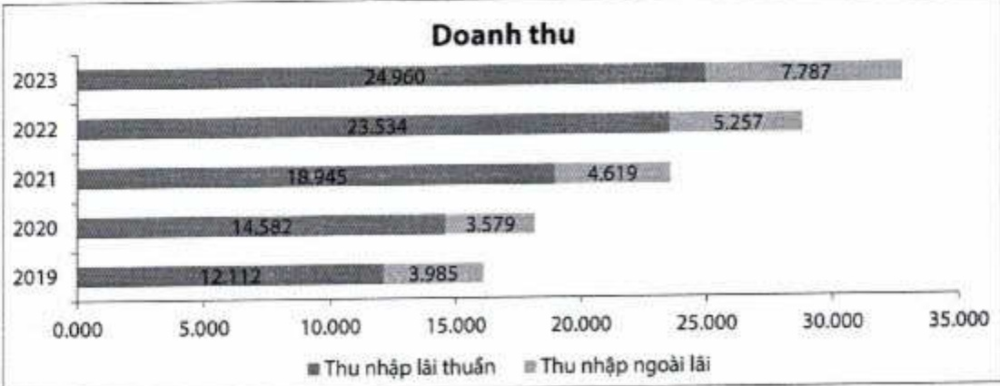

Thu nhập ngoài lãi năm 2023 tăng 48%, đạt 7,8 nghìn tỷ đồng, tăng tỷ trọng đồng góp trong tổng doanh thu từ 18% của năm 2022 lên 24%. Thu nhập từ hoạt động đầu tư chứng khoản và mua bán ngoại tệ tăng trưởng tốt nhờ tận dụng được các điều kiện thị trường thuận lợi. Thu nhập phí giảm 17% so với cùng kỳ, nguyên nhân chủ yếu từ hoạt động đại lý bảo hiểm nhân thọ (bancassurance) giảm mạnh theo tính hình chung của toàn thị trường.

- Hoạt động kinh doanh thê tăng trưởng 10% so với năm 2022, đạt gần 732 tỷ đồng, chủ yếu đến từ các dòng thê tín dụng quốc tế cao cấp (Visa Platinum, Visa Signature), dòng thê ghi nợ với tiện ích chi tiêu, mua sắm tại nước ngoài, và dòng thê tín dụng Visa Digi cho nhóm khách hàng quảng cáo trên các nền tăng mạng xã hội. Với các dòng thê chù lực trên, doanh số chi tiêu thê tăng 42% so với năm 2022, ứng với số lượng thê phát hành mới tăng trưởng 17%.

- Hoạt động thanh toán quốc tế, động góp tỷ trọng lớn thứ ba trong tổng phí dịch vụ của ACB, cũng ghi nhận giám 10% so với năm 2022 do chịu ảnh hưởng những khó khăn chung của hoạt động xuất nhập khẩu của khu vực doanh nghiệp trong năm 2023.

Doanh thu từ hoạt động đại lý bảo hiểm nhân thọ động góp tỷ trọng lớn trong thu nhập phí với tỷ lệ 58%, đạt gần 1,6 nghìn tỷ đồng, giảm 20% so với năm 2022. Tuy nhiên, hoạt động này của ACB tiếp tục giữ vững vị thế dẫn đầu về doanh số bán trong năm 2023.

###### 2.2.2. Chi phí hoạt động

- Chỉ phí hoạt động của ACB tới cuối năm gần 11 nghìn tỷ đồng, giảm 6% so với cùng kỳ, chủ yếu nhờ các biện pháp kiểm soát chi phí, giảm tỷ lệ CIR từ 40% của năm 2022 xuống còn 33%.

<table border=1 style='margin: auto; word-wrap: break-word;'><tr><td style='text-align: center; word-wrap: break-word;'>Chi tiêu (ĐVT: Tỷ đồng)</td><td style='text-align: center; word-wrap: break-word;'>2023</td><td style='text-align: center; word-wrap: break-word;'>2022</td><td style='text-align: center; word-wrap: break-word;'>Tăng trường (%)</td><td style='text-align: center; word-wrap: break-word;'>Tỷ trọng 2023 (%)</td></tr><tr><td style='text-align: center; word-wrap: break-word;'>Chi nộp thuế và các khoản phi, lệ phi</td><td style='text-align: center; word-wrap: break-word;'>19</td><td style='text-align: center; word-wrap: break-word;'>14</td><td style='text-align: center; word-wrap: break-word;'>30</td><td style='text-align: center; word-wrap: break-word;'>0</td></tr><tr><td style='text-align: center; word-wrap: break-word;'>Chi phí cho nhân viên</td><td style='text-align: center; word-wrap: break-word;'>6.215</td><td style='text-align: center; word-wrap: break-word;'>6.069</td><td style='text-align: center; word-wrap: break-word;'>2</td><td style='text-align: center; word-wrap: break-word;'>57</td></tr><tr><td style='text-align: center; word-wrap: break-word;'>Chi về tài sản</td><td style='text-align: center; word-wrap: break-word;'>1.780</td><td style='text-align: center; word-wrap: break-word;'>1.734</td><td style='text-align: center; word-wrap: break-word;'>3</td><td style='text-align: center; word-wrap: break-word;'>16</td></tr><tr><td style='text-align: center; word-wrap: break-word;'>Chi cho hoạt động quản lý công vụ</td><td style='text-align: center; word-wrap: break-word;'>2.346</td><td style='text-align: center; word-wrap: break-word;'>3.287</td><td style='text-align: center; word-wrap: break-word;'>-29</td><td style='text-align: center; word-wrap: break-word;'>22</td></tr><tr><td style='text-align: center; word-wrap: break-word;'>Chi nộp phí bảo hiểm, bảo toàn tiền gửi của khách hàng</td><td style='text-align: center; word-wrap: break-word;'>505</td><td style='text-align: center; word-wrap: break-word;'>455</td><td style='text-align: center; word-wrap: break-word;'>11</td><td style='text-align: center; word-wrap: break-word;'>5</td></tr><tr><td style='text-align: center; word-wrap: break-word;'>Chi phí dự phòng giảm giá các khoản đầu tư dài hạn và dự phòng nợ khô đòi</td><td style='text-align: center; word-wrap: break-word;'>9</td><td style='text-align: center; word-wrap: break-word;'>45</td><td style='text-align: center; word-wrap: break-word;'>-79</td><td style='text-align: center; word-wrap: break-word;'>0</td></tr><tr><td style='text-align: center; word-wrap: break-word;'>Tổng cộng</td><td style='text-align: center; word-wrap: break-word;'>10.874</td><td style='text-align: center; word-wrap: break-word;'>11.605</td><td style='text-align: center; word-wrap: break-word;'>-6</td><td style='text-align: center; word-wrap: break-word;'>100</td></tr></table>