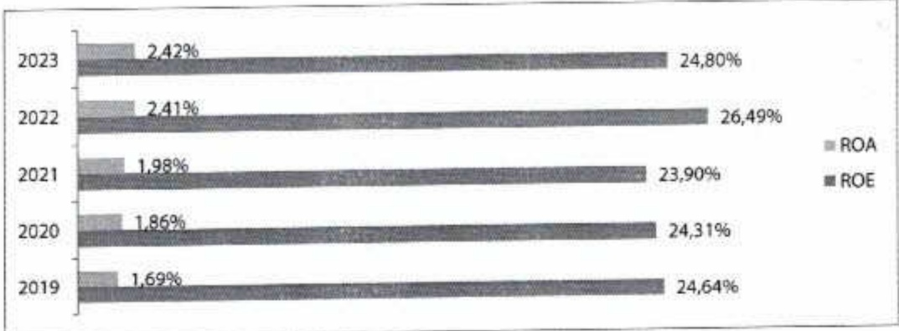

###### 2.2.3. Chi phí dự phòng

Trong năm 2023, chỉ phí dự phòng rủi ro tín dụng ở hầu hết các ngân hàng đều tăng cao. Chỉ phí này của ACB năm 2023 là (1.804) tỷ đồng, tăng (1.733) tỷ đồng so với cùng kỳ năm trước. Tỷ lệ bao phù nợ xấu đạt 91%, ở mức cao trong ngành.

###### 2.2.4. Tỷ suất lợi nhuận, lãi cơ bản mỗi cổ phiếu

ACB vẫn duy trì được tỷ suất lợi nhuận cao hàng đầu trong ngành. Nhiều năm liền, ROE ở mức trên 20%; và đạt gần 25% trong năm 2023. ROA tiếp tục tăng qua các năm, cuối năm 2023 đạt 2,4%.

EPS hiện đạt đạt mức ~4.092 đồng/cô phiếu, tăng so với EPS năm 2022 (4.008 đồng).

